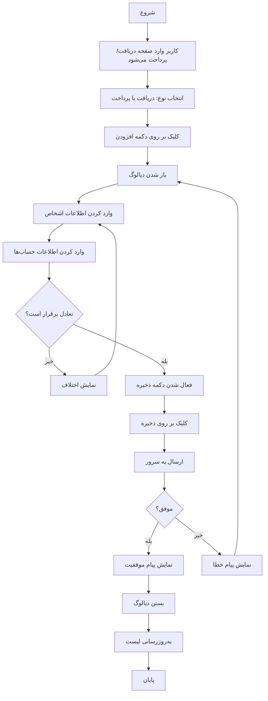

# 📝 سیستم دریافت و پرداخت (Receipt & Payment System)

## 📌 مقدمه

سیستم دریافت و پرداخت یک سیستم حسابداری است که برای ثبت تراکنش‌های مالی بین کسب‌وکار و اشخاص (مشتریان و تامین‌کنندگان) استفاده می‌شود.

## 🎯 هدف

این سیستم برای ثبت دو نوع سند طراحی شده است:

1. **دریافت (Receipt)**: دریافت وجه از اشخاص (مشتریان)
2. **پرداخت (Payment)**: پرداخت به اشخاص (تامین‌کنندگان/فروشندگان)

## 📊 ساختار داده

### سند (Document)

هر سند دریافت یا پرداخت شامل موارد زیر است:

```json
{
  "id": 123,
  "code": "RC-20250115-0001",
  "business_id": 1,
  "document_type": "receipt",  // یا "payment"
  "document_date": "2025-01-15",
  "currency_id": 1,
  "created_by_user_id": 5,
  "person_lines": [
    {
      "person_id": 10,
      "person_name": "علی احمدی",
      "amount": 1000000,
      "description": "تسویه حساب"
    }
  ],
  "account_lines": [
    {
      "account_id": 456,
      "account_name": "صندوق",
      "amount": 1000000,
      "description": ""
    }
  ]
}
```

### خطوط سند (Document Lines)

هر سند شامل دو نوع خط است:

1. **خطوط اشخاص (Person Lines)**: تراکنش‌های مربوط به اشخاص
2. **خطوط حساب‌ها (Account Lines)**: تراکنش‌های مربوط به حساب‌ها (صندوق، بانک، چک، ...)

## 🧮 منطق حسابداری

### 1️⃣ دریافت وجه از اشخاص (Receipt)

**سناریو**: دریافت ۱,۰۰۰,۰۰۰ تومان از مشتری "علی احمدی" به صندوق

#### ثبت در حساب‌ها:

```
صندوق (10202)                    بدهکار: 1,000,000
حساب دریافتنی - علی احمدی (10401) بستانکار: 1,000,000
```

#### منطق:
- **صندوق**: بدهکار می‌شود (چون دارایی افزایش یافته)
- **حساب دریافتنی شخص**: بستانکار می‌شود (چون بدهی مشتری کم شده)

#### کد نمونه (Frontend):

```dart
await service.createReceipt(
  businessId: 1,
  documentDate: DateTime.now(),
  currencyId: 1,
  personLines: [
    {
      'person_id': 10,
      'person_name': 'علی احمدی',
      'amount': 1000000,
      'description': 'تسویه حساب',
    }
  ],
  accountLines: [
    {
      'account_id': 456,  // شناسه حساب صندوق
      'amount': 1000000,
      'description': '',
    }
  ],
);
```

---

### 2️⃣ پرداخت به اشخاص (Payment)

**سناریو**: پرداخت ۵۰۰,۰۰۰ تومان به تامین‌کننده "رضا محمدی" از بانک

#### ثبت در حساب‌ها:

```
حساب پرداختنی - رضا محمدی (20201) بدهکار: 500,000
بانک (10203)                         بستانکار: 500,000
```

#### منطق:
- **حساب پرداختنی شخص**: بدهکار می‌شود (چون بدهی ما به تامین‌کننده کم شده)
- **بانک**: بستانکار می‌شود (چون دارایی کاهش یافته)

#### کد نمونه (Frontend):

```dart
await service.createPayment(
  businessId: 1,
  documentDate: DateTime.now(),
  currencyId: 1,
  personLines: [
    {
      'person_id': 20,
      'person_name': 'رضا محمدی',
      'amount': 500000,
      'description': 'پرداخت بدهی',
    }
  ],
  accountLines: [
    {
      'account_id': 789,  // شناسه حساب بانک
      'amount': 500000,
      'description': 'انتقال بانکی',
    }
  ],
);
```

---

## 🔧 نحوه استفاده از API

### 1. ایجاد سند دریافت/پرداخت

**Endpoint:** `POST /api/v1/businesses/{business_id}/receipts-payments/create`

**Request Body:**

```json
{
  "document_type": "receipt",
  "document_date": "2025-01-15",
  "currency_id": 1,
  "person_lines": [
    {
      "person_id": 10,
      "person_name": "علی احمدی",
      "amount": 1000000,
      "description": "تسویه حساب"
    }
  ],
  "account_lines": [
    {
      "account_id": 456,
      "amount": 1000000,
      "description": ""
    }
  ],
  "extra_info": {}
}
```

**Response:**

```json
{
  "success": true,
  "message": "RECEIPT_PAYMENT_CREATED",
  "data": {
    "id": 123,
    "code": "RC-20250115-0001",
    "business_id": 1,
    "document_type": "receipt",
    "document_date": "2025-01-15",
    "person_lines": [...],
    "account_lines": [...]
  }
}
```

### 2. دریافت لیست اسناد

**Endpoint:** `POST /api/v1/businesses/{business_id}/receipts-payments`

**Request Body:**

```json
{
  "skip": 0,
  "take": 20,
  "sort_by": "document_date",
  "sort_desc": true,
  "document_type": "receipt",
  "from_date": "2025-01-01",
  "to_date": "2025-01-31",
  "search": ""
}
```

### 3. دریافت جزئیات یک سند

**Endpoint:** `GET /api/v1/receipts-payments/{document_id}`

### 4. حذف سند

**Endpoint:** `DELETE /api/v1/receipts-payments/{document_id}`

---

## 📱 نحوه استفاده در Flutter

### 1. Import کردن سرویس:

```dart
import 'package:hesabix_ui/services/receipt_payment_service.dart';
```

### 2. ایجاد instance:

```dart
final service = ReceiptPaymentService(apiClient);
```

### 3. ایجاد سند دریافت:

```dart
try {
  final result = await service.createReceipt(
    businessId: 1,
    documentDate: DateTime.now(),
    currencyId: 1,
    personLines: [
      {
        'person_id': 10,
        'person_name': 'علی احمدی',
        'amount': 1000000,
        'description': 'تسویه حساب',
      }
    ],
    accountLines: [
      {
        'account_id': 456,
        'amount': 1000000,
        'description': '',
      }
    ],
  );
  
  print('سند با موفقیت ثبت شد: ${result['code']}');
} catch (e) {
  print('خطا در ثبت سند: $e');
}
```

---

## 🗂️ انواع حساب‌های مورد استفاده

| کد حساب | نام حساب | نوع | توضیحات |
|---------|----------|-----|---------|
| `10401` | حساب دریافتنی | `4` | طلب از مشتریان |
| `20201` | حساب پرداختنی | `9` | بدهی به تامین‌کنندگان |
| `10202` | صندوق | `1` | صندوق |
| `10203` | بانک | `3` | حساب بانکی |
| `10403` | اسناد دریافتنی | `5` | چک دریافتی |
| `20202` | اسناد پرداختنی | `10` | چک پرداختی |

---

## ✅ قوانین و محدودیت‌ها

### 1. تعادل سند:
- مجموع مبالغ **person_lines** باید برابر مجموع مبالغ **account_lines** باشد
- در غیر این صورت خطای `UNBALANCED_AMOUNTS` برگردانده می‌شود

### 2. اعتبارسنجی:
- حداقل یک خط برای اشخاص الزامی است
- حداقل یک خط برای حساب‌ها الزامی است
- تمام مبالغ باید مثبت باشند
- ارز باید معتبر باشد

### 3. ایجاد خودکار حساب شخص:
- اگر حساب شخص وجود نداشته باشد، به صورت خودکار ایجاد می‌شود
- کد حساب: `{parent_code}-{person_id}`
  - برای دریافت: `10401-{person_id}`
  - برای پرداخت: `20201-{person_id}`

---

## 🔄 جریان کار (Workflow)



---

## 🧪 مثال‌های کاربردی

### مثال 1: دریافت نقدی از مشتری

```dart
await service.createReceipt(
  businessId: 1,
  documentDate: DateTime.now(),
  currencyId: 1,
  personLines: [
    {
      'person_id': 10,
      'person_name': 'شرکت ABC',
      'amount': 5000000,
      'description': 'دریافت بابت فاکتور شماره 123',
    }
  ],
  accountLines: [
    {
      'account_id': 456,  // صندوق
      'amount': 5000000,
    }
  ],
);
```

**نتیجه در حساب‌ها:**
```
صندوق (10202)              بدهکار: 5,000,000
حساب دریافتنی - شرکت ABC  بستانکار: 5,000,000
```

---

### مثال 2: دریافت با چک از مشتری

```dart
await service.createReceipt(
  businessId: 1,
  documentDate: DateTime.now(),
  currencyId: 1,
  personLines: [
    {
      'person_id': 15,
      'person_name': 'علی رضایی',
      'amount': 3000000,
      'description': 'دریافت بابت فاکتور 456',
    }
  ],
  accountLines: [
    {
      'account_id': 789,  // اسناد دریافتنی (چک)
      'amount': 3000000,
      'description': 'چک شماره 12345678',
    }
  ],
);
```

**نتیجه در حساب‌ها:**
```
اسناد دریافتنی (10403)      بدهکار: 3,000,000
حساب دریافتنی - علی رضایی  بستانکار: 3,000,000
```

---

### مثال 3: دریافت مختلط (نقد + چک)

```dart
await service.createReceipt(
  businessId: 1,
  documentDate: DateTime.now(),
  currencyId: 1,
  personLines: [
    {
      'person_id': 20,
      'person_name': 'محمد حسینی',
      'amount': 10000000,
      'description': 'تسویه کامل',
    }
  ],
  accountLines: [
    {
      'account_id': 456,  // صندوق
      'amount': 4000000,
      'description': 'نقد',
    },
    {
      'account_id': 789,  // چک دریافتنی
      'amount': 6000000,
      'description': 'چک شماره 87654321',
    }
  ],
);
```

**نتیجه در حساب‌ها:**
```
صندوق (10202)                بدهکار: 4,000,000
اسناد دریافتنی (10403)        بدهکار: 6,000,000
حساب دریافتنی - محمد حسینی   بستانکار: 10,000,000
```

---

### مثال 4: پرداخت نقدی به تامین‌کننده

```dart
await service.createPayment(
  businessId: 1,
  documentDate: DateTime.now(),
  currencyId: 1,
  personLines: [
    {
      'person_id': 30,
      'person_name': 'شرکت XYZ',
      'amount': 8000000,
      'description': 'پرداخت بابت خرید کالا',
    }
  ],
  accountLines: [
    {
      'account_id': 456,  // صندوق
      'amount': 8000000,
    }
  ],
);
```

**نتیجه در حساب‌ها:**
```
حساب پرداختنی - شرکت XYZ  بدهکار: 8,000,000
صندوق (10202)             بستانکار: 8,000,000
```

---

### مثال 5: پرداخت به چند تامین‌کننده

```dart
await service.createPayment(
  businessId: 1,
  documentDate: DateTime.now(),
  currencyId: 1,
  personLines: [
    {
      'person_id': 35,
      'person_name': 'تامین‌کننده A',
      'amount': 2000000,
    },
    {
      'person_id': 40,
      'person_name': 'تامین‌کننده B',
      'amount': 3000000,
    }
  ],
  accountLines: [
    {
      'account_id': 890,  // بانک
      'amount': 5000000,
    }
  ],
);
```

**نتیجه در حساب‌ها:**
```
حساب پرداختنی - تامین‌کننده A  بدهکار: 2,000,000
حساب پرداختنی - تامین‌کننده B  بدهکار: 3,000,000
بانک (10203)                   بستانکار: 5,000,000
```

---

## 🐛 خطاهای رایج و راه‌حل

| کد خطا | توضیحات | راه‌حل |
|--------|---------|--------|
| `INVALID_DOCUMENT_TYPE` | نوع سند نامعتبر | از "receipt" یا "payment" استفاده کنید |
| `CURRENCY_REQUIRED` | ارز الزامی است | currency_id را ارسال کنید |
| `PERSON_LINES_REQUIRED` | حداقل یک خط شخص الزامی | person_lines را پر کنید |
| `ACCOUNT_LINES_REQUIRED` | حداقل یک خط حساب الزامی | account_lines را پر کنید |
| `UNBALANCED_AMOUNTS` | عدم تعادل مبالغ | مجموع person_lines و account_lines باید برابر باشد |
| `PERSON_NOT_FOUND` | شخص یافت نشد | شناسه شخص را بررسی کنید |
| `ACCOUNT_NOT_FOUND` | حساب یافت نشد | شناسه حساب را بررسی کنید |

---

## 📝 نکات مهم

1. **تعادل سند**: همیشه مطمئن شوید که مجموع مبالغ اشخاص با مجموع مبالغ حساب‌ها برابر است.

2. **ایجاد خودکار حساب**: اگر حساب شخص وجود نداشته باشد، به صورت خودکار ایجاد می‌شود.

3. **کد سند**: کد سند به صورت خودکار با فرمت زیر تولید می‌شود:
   - دریافت: `RC-YYYYMMDD-NNNN`
   - پرداخت: `PY-YYYYMMDD-NNNN`

4. **منطق حسابداری**:
   - **دریافت**: شخص بستانکار، حساب (صندوق/بانک) بدهکار
   - **پرداخت**: شخص بدهکار، حساب (صندوق/بانک) بستانکار

5. **چند شخص/چند حساب**: می‌توانید در یک سند چند شخص و چند حساب داشته باشید.

---

## 📚 منابع مرتبط

- [مستندات API](/hesabixAPI/README.md)
- [راهنمای استفاده از Flutter](/hesabixUI/hesabix_ui/README.md)
- [ساختار حساب‌ها](/docs/ACCOUNTS_STRUCTURE.md)

---

**تاریخ ایجاد**: 2025-01-13  
**نسخه**: 1.0.0  
**توسعه‌دهنده**: تیم Hesabix

