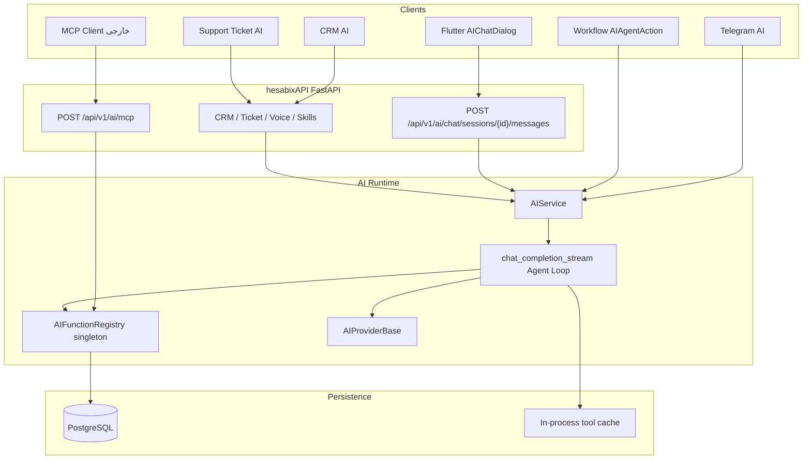
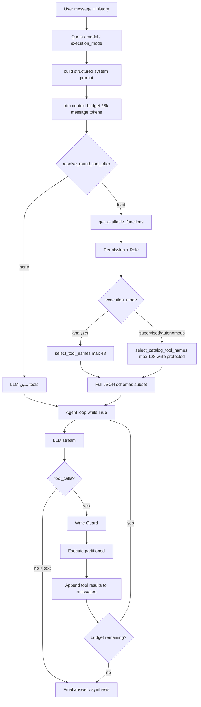
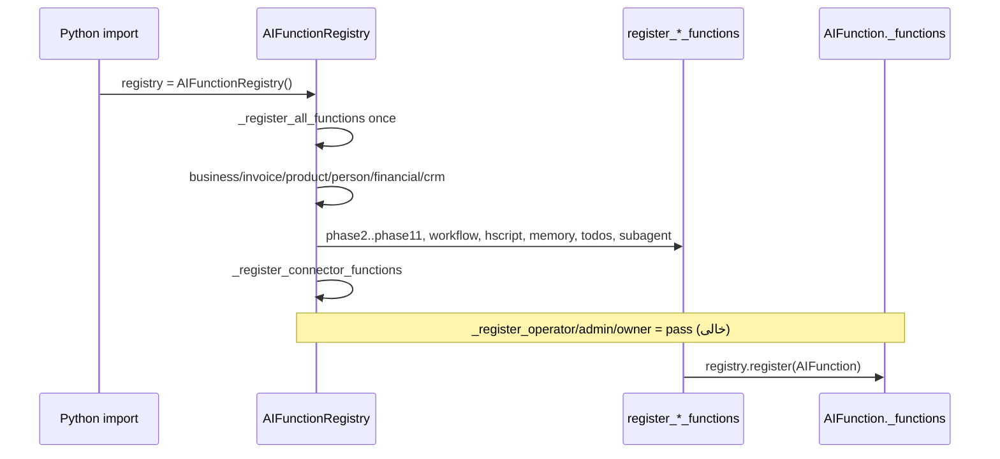
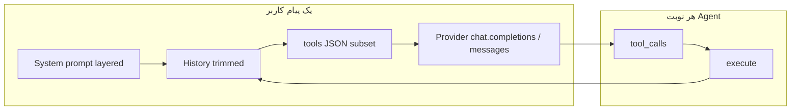
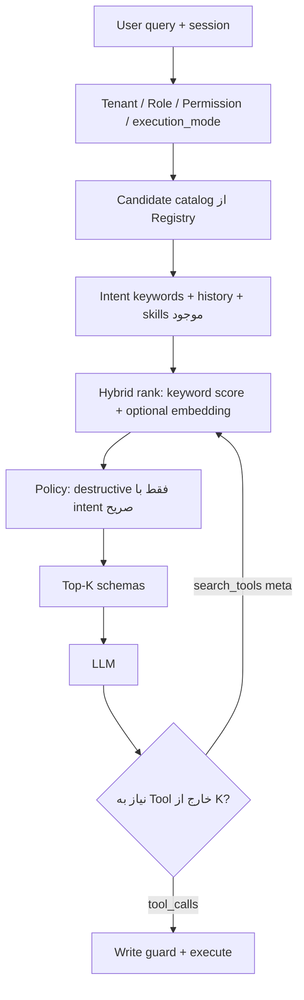
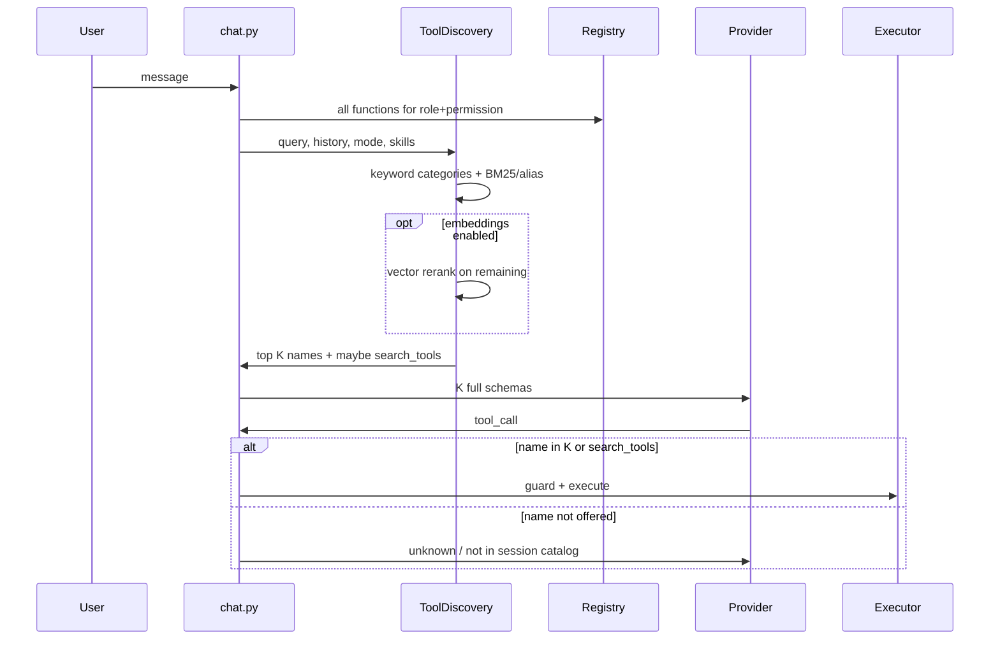

# Dynamic Tool Discovery — Phase 0 Analysis & Architecture

**وضعیت سند:** Phase 0 — فقط بررسی و طراحی؛ هیچ کد منبعی در این مرحله تغییر نکرده است.  
**تاریخ بررسی:** ۱۹ اوت ۲۰۲۶ (۱۴۰۵/۰۵/۲۸)  
**دامنه کد:** `hesabixAPI/app/services/ai/`، `hesabixAPI/adapters/api/v1/ai/`، مدل‌های `ai_*`، تست‌های `tests/test_ai_tool_*.py`  
**اسناد مرتبط:** [`../AI_AGENT_SYSTEM_AUDIT.md`](../AI_AGENT_SYSTEM_AUDIT.md)، [`../AI_EXECUTION_PHASES.md`](../AI_EXECUTION_PHASES.md)، [`../AI_AGENT_RUNTIME_CAPABILITIES_SCENARIO.md`](../AI_AGENT_RUNTIME_CAPABILITIES_SCENARIO.md)

> **قانون این سند:** هر ادعای «وضعیت فعلی» باید از کد آمده باشد. اگر چیزی از روی کد قابل اثبات نبود، با برچسب **Unknown / نیازمند بررسی** آمده است.

---

## 1. Executive Summary

سیستم فعلی یک **Accounting Agent چندنوبتی** است که ابزارها را در یک **Registry مرکزی Singleton** ثبت می‌کند، قبل از ارسال به LLM با **نقش + Permission + Intent کلیدواژه‌ای** فیلتر می‌کند، و اجرا را از مسیر **Write Guard + Execution Mode** رد می‌کند.

عدد «حدود ۱۲۰۰ Tool» با کد فعلی **مطابقت ندارد**.

| ادعا | واقعیت از کد |
|------|----------------|
| ~۱۲۰۰ ابزار AI | **۱۸۰** `AIFunction` یکتا با `name=` در Registry |
| همه Toolها در هر درخواست به LLM می‌روند | خیر. پس از Permission، Intent و سقف: حداکثر **۴۸** (حالت تحلیلگر) یا **۱۲۸** (حالت با تأیید / خودکار) |
| Schema همه ابزارها همیشه در Context است | خیر. فقط زیرمجموعهٔ فیلترشده. اما همان زیرمجموعه در **هر نوبت حلقهٔ Agent دوباره** به API مدل فرستاده می‌شود |
| MCP برای بارگذاری پویای Tool به داخل Agent | خیر. MCP فعلی یک **سرور خروجی** است (`POST /api/v1/ai/mcp`) که همان Registry را به کلاینت خارجی می‌دهد |
| وابستگی به یک Provider | خیر از نظر Abstraction. کلاینت‌ها: `OpenAIProvider`، `AnthropicProvider`، `LocalProvider`. مدل زنده از **دیتابیس** (`ai_configs` / `ai_models`) خوانده می‌شود |

**مشکل اصلی مقیاس Tool، تعداد ۱۲۰۰ ثبت‌شده نیست؛ چند منبع حقیقت پراکنده + سقف سخت ۴۸/۱۲۸ + ranking واژه‌ای بدون embedding است.** اگر کاتالوگ به چند هزار Tool برسد، همین معماری بدون لایهٔ Discovery معنایی و بدون Progressive Disclosure می‌شکند.

**پیشنهاد سطح بالا:** Registry فعلی را دور نریزید. آن را به یک **Tool Catalog با Metadata واحد** ارتقا دهید، فیلتر امنیتی را **قبل از جستجو** نگه دارید، Top-K را برای حالت تحلیلگر کاهش دهید، و برای مقیاس هزاران Tool یک **meta-tool کشف** اضافه کنید — نه اینکه هر Endpoint بک‌اند را یک Tool جدا کنید.

---

## 2. Current Architecture

پروژه یک بک‌اند FastAPI (`hesabixAPI`) و کلاینت Flutter (`hesabixUI`) است. Agent داخل بک‌اند اجرا می‌شود؛ UI فقط SSE/REST مصرف می‌کند.



### 2.1 Entry points

| سطح | مسیر | نقش |
|-----|------|-----|
| چت اصلی | `adapters/api/v1/ai/chat.py` → `send_message` | حلقهٔ کامل + SSE |
| MCP | `adapters/api/v1/ai/mcp.py` | JSON-RPC `tools/list` و `tools/call` |
| CRM | `adapters/api/v1/ai/crm_ai.py` | Allowlist فقط‌خواندنی CRM، سقف ۴ نوبت |
| تیکت | مسیر support AI (سیاست در `ai_channel_policy.py`) | Allowlist مالی فقط‌خواندنی، سقف ۴ نوبت |
| ورک‌فلو | اکشن Agent در workflow | سیاست جدا در `ai_workflow_agent_policy.py` |
| صوت | `voice_ws.py` / `voice_http.py` | کانال جدا؛ جزئیات حلقهٔ Tool در این Phase به‌صورت کامل trace نشد (**نیازمند بررسی** اگر صوت همان `get_available_functions` را صدا می‌زند) |
| تلگرام | سرویس تلگرام (اشاره‌شده در ممیزی) | جزئیات فیلتر Tool در این بررسی به‌طور کامل باز نشد (**Unknown / نیازمند بررسی**) |

### 2.2 Backend stack مشهود از کد

| جزء | وضعیت در کد |
|-----|-------------|
| API | FastAPI — `app/main.py` حدود ۱۰۰ `include_router` |
| DB | `docker-compose.yml` سرویس `postgres:16`. مهاجرت `20260626_000002_ai_pgvector_optional.py` برای دانشنامه |
| Redis | در زیرسیستم AI **استفاده نمی‌شود**. کش Tool درون‌پردازه‌ای است (`ai_tool_cache.py`). Redis در سایر بخش‌های محصول (ادمین/باسلام) مستند شده |
| Auth | `AuthContext` + `X-Business-ID` + membership/owner checks |
| Tenant | `business_id` از session چت inject می‌شود؛ مدل نمی‌تواند tenant را عوض کند |

### 2.3 فهرست قابلیت‌های Agent که در کد وجود دارند

| قابلیت | فایل اصلی | وضعیت |
|--------|-----------|--------|
| Agent Loop | `ai_service.py` `chat_completion_stream` | حلقه `while True` با بودجه |
| LLM Client | `ai_provider.py` | OpenAI / Anthropic / Local |
| Model Config | `ai_config.py`, `ai_model.py`, `ai_model_service.py` | از DB؛ پیش‌فرض کلاس `gpt-4` |
| Tool Registry | `function_registry.py` | Singleton، ثبت در `__init__` |
| Tool Definitions | `ai_function_extensions*.py` | Static Python |
| Tool Schemas | JSON Schema داخل `AIFunction.parameters_schema` + `ai_tool_payloads.py` | Static |
| Tool Execution | `call_function` / `run_ai_registry_function` | Session DB جدا per call |
| Tool Dispatcher | `handle_function_calls_async` + `ai_tool_parallel.py` | Read موازی تا ۴، Write سریال |
| MCP Server | `ai_mcp_service.py` | هست |
| MCP Client (ورود Tool خارجی به Agent) | — | **وجود ندارد** |
| Memory | `ai_memory_service.py`, `ai_memory_item_service.py`, toolهای memory | هست |
| RAG / Knowledge | `ai_knowledge_service.py`, `ai_embedding_service.py` | Hybrid: کلمه + embedding اختیاری pgvector |
| Prompt Management | `prompt_service.py`, جدول `ai_prompts` | هست |
| Context Management | `ai_context_budget.py`, `ai_system_prompt.py` | بودجه ۲۸٬۰۰۰ توکن **برای پیام‌ها** |
| Streaming | SSE در `chat.py` | هست |
| Logging / Metrics | `ai_ops_metrics.py` (`AI_METRIC`) | هست؛ Langfuse/Phoenix نیست |
| Error Handling | `ai_tool_error.py`, `ApiError` | هست |
| Retry | `ai_retry_policy.py` حداکثر ۳ بار | هست |
| Caching | Prompt cache Provider + کش نتیجه Tool ۶۰ثانیه | هست |
| Conversation | `ai_chat_session` / `ai_chat_message` | هست |
| Subagent | `ai_subagent.py` | موقت، سقف ۲×۴ نوبت، بدون write |

---

## 3. Agent Architecture

قلب سیستم `AIService.chat_completion_stream` است (`ai_service.py`).

### 3.1 حلقهٔ فعلی



رفتارهای مهم حلقه که از کد خوانده شد:

1. **بودجه چندبعدی:** نوبت (۳/۶/۱۲ بر اساس complexity، سقف مطلق ۱۵)، توکن کل، wall-clock، ۲ نوبت بی‌حاصل، حداکثر ۲ تمدید (`ai_constants.py`, `ai_budget.py`).
2. **Planning:** برای سوال `complex` ممکن است `tool_choice` روی `create_session_plan` قفل شود (OpenAI/Anthropic).
3. **tool_choice=required:** اگر سوال داده‌محور باشد و provider در `PROVIDERS_WITH_FORCED_TOOLS` باشد.
4. **Forced synthesis:** اگر evidenc هست ولی متن نهایی نیامد، یک نوبت بدون Tool.
5. **Run persist:** جدول `ai_agent_runs` و continue API در ممیزی به‌عنوان انجام‌شده آمده؛ حلقه همچنان داخل همان درخواست HTTP است (AGT-02 هنوز باز).
6. **Subagent:** `spawn_subagent` / `await_subagent` / `cancel_subagent`؛ فرزند analyzer و بدون write.

### 3.2 LLM Client و مدل

Abstraction: `AIProviderBase` با `chat_completion` و `chat_completion_stream`.

| Provider type | کلاس | سازگاری Tool |
|---------------|------|----------------|
| `openai` | `OpenAIProvider` | `tools` به سبک OpenAI Chat Completions |
| `anthropic` | `AnthropicProvider` | تبدیل `_openai_tools_to_anthropic` |
| `local` | `LocalProvider` | همان قرارداد OpenAI-compatible |

مدل **hard-code نیست**. منبع حقیقت:

- `AIConfig.model_name` پیش‌فرض کلاس: `"gpt-4"`
- کاتالوگ `ai_models` با `code`, `provider`, `model_id`, `supports_tools`
- Routing: `ai_model_router.py` + `ai_model_service.py` (شامل مدل مجازی `auto`)
- BYOK: `business_ai_provider_service.py`

**Unknown / نیازمند بررسی:** مدل و Provider واقعی production (مقدار ردیف‌های `ai_configs` / `ai_models` در این مرحله از روی کد قابل خواندن نیست).

`estimate_tokens` در هر سه Provider برابر است با `len(text) // 4`. این تقریب است نه tokenizer رسمی.

---

## 4. Current Tool Architecture

### 4.1 تعداد واقعی Toolها

شمارش استاتیک روی `AIFunction(name="...")` در فایل‌های Registry:

| منبع ثبت | تعداد |
|----------|------:|
| `function_registry.py` | 32 |
| `ai_function_extensions.py` | 18 |
| `ai_function_extensions_phase2.py` | 15 |
| `ai_function_extensions_phase3.py` | 17 |
| `ai_function_extensions_phase4.py` | 10 |
| `ai_function_extensions_phase5.py` | 6 |
| `ai_function_extensions_phase6.py` | 1 |
| `ai_function_extensions_phase7.py` | 5 |
| `ai_function_extensions_phase8.py` | 7 |
| `ai_function_extensions_phase10.py` | 2 |
| `ai_function_extensions_phase11.py` | 38 |
| `ai_function_extensions_workflow.py` | 13 |
| `ai_function_extensions_hscript.py` | 7 |
| `ai_function_extensions_memory.py` | 3 |
| `ai_function_extensions_session_todos.py` | 3 |
| `ai_function_extensions_subagent.py` | 3 |
| **جمع یکتا** | **۱۸۰** |

نام تکراری در ثبت پیدا نشد (۱۸۰ `register()` و ۱۸۰ نام یکتا).

اسناد قدیمی‌تر (`AI_CAPABILITY_GAP_SCENARIO_V2.md`: ~۱۱۲، ممیزی: ~۱۰۰+) از کد امروز عقب‌ترند.

### 4.2 عدد ۱۲۰۰ از کجا می‌تواند آمده باشد؟

در کد AI، ۱۲۰۰ Tool وجود ندارد. فرض‌های محتمل که **باید با محصول تأیید شوند** (حدس به‌عنوان واقعیت گزارش نمی‌شود):

| فرض | شواهد |
|-----|--------|
| هدف مقیاس آینده | مأموریت همین سند |
| اشتباه با Endpointهای REST | `app/main.py` حدود ۱۰۰ روتر؛ تعداد دقیق Route شمارش نشد (**نیازمند بررسی** اگر عدد ۱۲۰۰ از OpenAPI آمده) |
| گسترش درونی یک Tool | `get_report` حدود **۳۸** `report_type`؛ `query_business_data` حدود **۳۰** entity (۱۳ فاز۱ + ۱۰ فاز۲ + ۳ فاز۳ + ۴ فاز۴) |
| جمع Tool + entity + report به‌صورت «قابلیت» | اگر کسی ۱۸۰ + ۳۸ + ۳۰ + نودهای workflow را با هم جمع کند باز به ۱۲۰۰ نمی‌رسد |

**نتیجه قابل اتکا:** سطح Tool قابل فراخوانی توسط LLM امروز **۱۸۰ function** است، نه ۱۲۰۰.

### 4.3 مدل دادهٔ فعلی Tool

```python
# function_registry.py — AIFunction
name: str
description: str
parameters_schema: Dict[str, Any]
handler: Callable
allowed_roles: Set[AIRole]
required_permissions: Optional[List[str]] = None
business_context_required: bool = True
category: Optional[str] = None
requires_approval: bool = False
risk_level: str = "safe"          # safe / medium / high
is_readonly: bool = True
is_agent_internal: bool = False
```

آنچه **در dataclass نیست** و امروز در فایل‌های جدا پخش شده:

| نیاز | محل فعلی |
|------|-----------|
| Intent category / keywords | `ai_tool_intent.py` `_CATEGORY_TOOLS`, `_KEYWORD_CATEGORIES` |
| Alias برای ranking | `ai_tool_rank.py` `TOOL_ALIASES` |
| Write list موازی | `ai_tool_intent._WRITE_TOOLS` و `ai_write_guard.WRITE_FUNCTIONS` |
| High-risk always-approve | `ai_execution_policy.HIGH_RISK_ALWAYS_APPROVE` |
| i18n | `ai_tool_keys.py` |
| Skill allowlist | جدول `ai_skills` / `allowed_tool_names` |
| Embedding | وجود ندارد برای Tool |
| Examples / few-shot | در Schemaها مشاهده نشد (`example` در توصیف/schema استاتیک صفر مورد) |
| Namespace فراتر از `category` | وجود ندارد |
| Destructive جدا از `risk_level` و `delete_*` | فیلد جدا نیست |

### 4.4 توزیع Metadata (شمارش AST روی ۱۸۰ ثبت)

| فیلد | مشاهده |
|------|--------|
| `requires_approval=True` | ۳۸ |
| `is_readonly=False` | ۴۱ |
| `is_readonly` پیش‌فرض True (صریح نشده) | ۱۰۱ |
| `is_agent_internal=True` | ۶ |
| بدون `required_permissions` | ۲۲ |
| `risk_level=high` | ۲۳ |
| `risk_level=medium` | ۱۷ |
| `risk_level` پیش‌فرض safe | ۱۳۲ |
| `category` خالی | ۰ در ثبت‌های دیده‌شده؛ مقادیر متنوع (business, invoices, financial, …) |
| Schema با `properties: {}` یا خالی | ۵۹ |
| Examples در schema/description | ۰ |

`category` در Registry با کلیدهای Intent یکی نیست. مثلاً Registry `invoices` / `persons` دارد؛ Intent از `financial` / `people` استفاده می‌کند. دو طبقه‌بندی موازی است.

### 4.5 Static در برابر Dynamic

| نوع | وضعیت |
|-----|--------|
| ثبت Tool | **Static** — import-time در Singleton |
| Connector HTTP | یک Tool ثابت `invoke_business_connector`؛ لیست کانکتورها به **prompt** تزریق می‌شود نه به صورت Tool جدا |
| Skill | فیلتر/اتحاد نام Toolهای موجود؛ Tool جدید نمی‌سازد |
| MCP inbound | نیست |
| تولید خودکار از OpenAPI | نیست |

### 4.6 همپوشانی عملیاتی (Duplicate capability)

نام تکراری نیست، اما **چند مسیر برای یک سؤال** وجود دارد:

- `search_invoices` در کنار `query_business_data(entity=invoice)`
- `get_sales_report` / `get_debtors_report` / … در کنار `get_report(report_type=...)`
- `search_persons` در کنار `query_business_data(entity=person)`

این همپوشانی عمدی (fan-in + dedicated) است، ولی انتخاب مدل را سخت‌تر می‌کند.

### 4.7 Toolهایی که در نقشهٔ Intent نیستند

۲۱ نام ثبت‌شده در هیچ دستهٔ `_CATEGORY_TOOLS` نیستند (ممکن است فقط از مسیر write-protected catalog یا core نیایند):

`create_account`, `create_check`, `create_invoice`, `create_product_attribute`, `create_transfer`, `delete_account`, `delete_check`, `delete_product_attribute`, `delete_transfer`, `get_wallet_metrics`, `list_announcements`, `list_business_notification_logs`, `list_business_notification_templates`, `list_business_users`, `list_frequent_descriptions`, `list_my_businesses`, `list_user_notifications`, `update_account`, `update_check`, `update_product_attribute`, `update_transfer`

برخی از این‌ها در `_WRITE_TOOLS` هستند (`create_invoice`, `create_check`, …) و با کلیدواژهٔ نوشتن اضافه می‌شوند. بقیه در حالت تحلیلگر به‌راحتی از دست می‌روند.

عملیات نوشتنی ثبت‌شده که در `_WRITE_TOOLS` نیستند:

`create_product_attribute`, `create_session_plan`, `delete_check`, `delete_expense_income`, `delete_memory_entry`, `delete_product_attribute`, `delete_receipt_payment`, `delete_transfer`, `update_check`, `update_product_attribute`, `update_session_todo`, `update_transfer`

`create_session_plan` / `update_session_todo` داخلی Agent هستند (`is_agent_internal`) و عمداً write کسب‌وکار نیستند. بقیه شکاف امنیتی/intent هستند.

---

## 5. Tool Registration Flow



نکات:

- Lazy/singleton: بار اول import، همه Toolها در حافظهٔ فرایند می‌مانند.
- Operator/Admin/Business-owner اختصاصی **ثبت نشده** (`pass`). نقش‌ها در enum هستند ولی کاتالوگ جدا ندارند (TOOL-02 ممیزی، وضعیت باز).
- Schema یا از dict لغوی ساخته می‌شود یا از ثابت‌های `ai_tool_payloads.py` (فاکتور/شخص/کالا و …).
- Description دستی و فارسی است؛ تولید خودکار از OpenAPI نیست.

---

## 6. Tool Execution Flow

```mermaid
sequenceDiagram
  participant LLM
  participant Loop as Agent Loop
  participant Guard as Write Guard / Execution Policy
  participant Cache as ai_tool_cache
  participant DB as run_ai_registry_function
  participant Reg as registry.call_function

  LLM-->>Loop: tool_calls
  Loop->>Guard: is_write? analyzer? high-risk? approved?
  alt blocked
    Guard-->>Loop: APPROVAL_REQUIRED / read-only mode
  else allowed
    Loop->>Cache: readonly hit?
    Cache-->>Loop: maybe
    Loop->>DB: new DB session
    DB->>Reg: role + permission + inject business_id
    Reg-->>Loop: result envelope
    Loop->>Cache: set / invalidate on write
  end
  Loop->>LLM: role=tool JSON truncated
```

جزئیات اجرا:

1. **Unknown tool:** `unknown_tool_result` — مدل نام جعلی می‌سازد.
2. **Analyzer:** `should_block_write_in_analyzer` اگر `is_write_function` (منبع: `requires_approval` در Registry؛ نام ناشناخته fail-closed = write فرض می‌شود).
3. **Supervised / high-risk autonomous:** `build_approval_required_result` تا UI تأیید بدهد؛ اجرای بعدی با `approve_writes` + `approved_write_calls` و تطبیق آرگومان.
4. **Session cache:** فقط `is_readonly`، TTL ۶۰ ثانیه، per `(business_id, session_id)`، درون‌پردازه‌ای.
5. **Parallelism:** `MAX_PARALLEL_READ_TOOLS = 4`؛ write همیشه سریال.
6. **Tenant:** `business_id` از session؛ اگر مدل `business_id` دیگری بدهد فقط در صورت `can_access_business` لاگ می‌شود و handler باز هم session را استفاده می‌کند.
7. **نتیجه:** سقف حدود ۶۰۰۰ کاراکتر JSON و ۱۵ رکورد (`MAX_TOOL_RESULT_JSON_CHARS`, `MAX_TOOL_RESULT_RECORDS`).

---

## 7. LLM Request Flow



`get_available_functions` **یک‌بار قبل از حلقه** صدا زده می‌شود (`ai_service.py` حدود ۲۱۱۶–۲۱۴۲). سپس همان لیست `tools` در **هر iteration** به `provider.chat_completion_stream(..., tools=tools)` می‌رود (حدود ۲۲۹۵–۲۳۰۰).

یعنی:

- Schema Tool در هر نوبت LLM تکرار می‌شود.
- Intent در وسط حلقه بر اساس نتایج Tool دوباره محاسبه نمی‌شود (**بازمحاسبهٔ پویا داخل loop وجود ندارد**).
- اگر `resolve_round_tool_offer` بگوید `none` (سوال غیر داده‌محور و کالر لیست نداده)، اصلاً Tool نمی‌رود.

کانال‌های جانبی اگر خودشان `tools=` بدهند، حلقه آن را `keep` می‌کند و Intent چت را جایگزین نمی‌کند (`ai_channel_policy.resolve_round_tool_offer`).

MCP `tools/list` **Intent و سقف ۴۸/۱۲۸ را اعمال نمی‌کند**؛ فقط Role + Permission + business_context. در مقیاس بزرگ این مسیر همهٔ Toolهای مجاز کاربر را یکجا برمی‌گرداند.

---

## 8. Current Token Consumption

### 8.1 چه چیزی وارد Context می‌شود؟

| لایه | محتوا | Cache |
|------|--------|--------|
| Static system | نقش از DB + business anchor | Prompt cache (Anthropic `cache_control` / OpenAI `prompt_cache_key` فقط api.openai.com) |
| Semi-static | حافظه + insights + connectors | لایهٔ نیمه‌پایدار |
| Dynamic system | execution_mode، datetime، knowledge، skills، attachments، todos | نه |
| Messages | تاریخچه تا ۴۰ پیام، trim در ۲۸k توکن تخمینی | conversation cache در صورت فعال بودن policy |
| **tools parameter** | JSON تعریف Functionها | **جدا از system prompt؛ در بودجه ۲۸k پیام حساب نمی‌شود** |

یافتهٔ مهم: `ai_context_budget.estimate_messages_tokens` محتوای `tools` را جمع نمی‌زند. هزینهٔ Schema Tool روی Context Window مدل هست، اما روی `CONTEXT_INPUT_TOKEN_BUDGET` دیده نمی‌شود.

### 8.2 اندازه‌گیری Schema (استاتیک)

روش: AST روی ۱۸۰ `AIFunction`، `json.dumps` معادل OpenAI `tools` array، تقریب توکن همان `chars/4` که خود Provider استفاده می‌کند.

| سناریو | تقریب توکن Schema |
|--------|------------------:|
| ۱۴۵ Tool با schema لغوی قابل parse + بقیه `{}` | ~۱۶٬۴۰۸ برای هر ۱۸۰ |
| میانگین Toolهای parseشده | ~۹۱ توکن / Tool |
| ۴۸ Tool (سقف تحلیلگر) × میانگین | ~۴٬۴۰۰ |
| ۱۲۸ Tool (سقف autonomous) × میانگین | ~۱۱٬۷۰۰ |
| ۱۸۰ Tool کامل | ≥ ۱۶٬۴۰۰ |
| اگر کاتالوگ به ۱۲۰۰ Tool با همین میانگین برسد | ~۱۰۹٬۰۰۰ فقط تعریف Tool |

**کم‌برآوردی قطعی:** ۱۹ schema تو در تو و چند ثابت `CREATE_*_PARAMETERS_SCHEMA` (فاکتور، شخص، کالا، دریافت/پرداخت) به‌خاطر `dict(...)` / `Call` در AST به‌صورت `{}` شمرده شدند. این‌ها معمولاً **بزرگ‌ترین** Schemaها هستند. عدد واقعی ۱۸۰ Tool **بالاتر از ۱۶.۴k** است.

اندازهٔ چند schema نام‌دار که parse شدند:

| ثابت | حدود توکن |
|------|----------:|
| `CREATE_WAREHOUSE_DOCUMENT_PARAMETERS_SCHEMA` | ~۳۰۶ |
| `_INVOICE_LINE_ITEM_SCHEMA` | ~۳۲۶ |
| `_CASH_SIDE_LINE_SCHEMA` | ~۳۸۷ |
| `CREATE_CHECK_PARAMETERS_SCHEMA` | ~۲۵۱ |

**Unknown بدون اجرای runtime:** توکن واقعی یک request زنده (system + history + tools + output) چون به مدل/تاریخچه/insights وابسته است.

### 8.3 روش اندازه‌گیری پیشنهادی برای Phase بعد (بدون حدس عدد زنده)

1. تست واحد: instantiate `AIFunctionRegistry` در محیط pytest، `get_function_definitions` با یک `AuthContext` جعلی superadmin.
2. `json.dumps(definitions)` و `len//4` به‌علاوه در صورت وجود `tiktoken` برای مدل واقعی.
3. سه snapshot: analyzer+query نمونه، supervised write، MCP `tools/list`.
4. لاگ موجود `context_usage` را گسترش دهید تا `tools_json_chars` / `tools_count` هم برود (`log_ai_event("context_usage", ...)` امروز `static_tokens` و `estimated_tokens` پیام را دارد، نه tools).
5. از `usage.cached_tokens` Provider برای اثر Prompt Cache استفاده کنید؛ Cache روی `tools` بسته به Provider است و در کد جداگانه تضمین نشده.

### 8.4 پاسخ به سؤال‌های Token

| سؤال | پاسخ از کد |
|------|------------|
| آیا Schema هر ۱۸۰/۱۲۰۰ به مدل می‌رود؟ | ۱۸۰ وجود دارد؛ همه نمی‌روند. سقف ۴۸ یا ۱۲۸ پس از فیلتر |
| چند Tool در هر Request؟ | ۰ اگر routing tools نخواهد؛ وگرنه ≤۴۸ یا ≤۱۲۸ |
| آیا هر Turn دوباره می‌رود؟ | بله، هر iteration حلقه |
| Prompt Caching؟ | بله برای system prefix؛ نه به‌عنوان کش اختصاصی Tool definition |
| Tool Definitions Cache؟ | نه در سطح LLM. فقط نتیجهٔ اجرای read-only |
| Context Window تحت تأثیر Tool؟ | بله در API مدل؛ نه در بودجه داخلی ۲۸k |
| Tool نامرتبط هزینه را زیاد می‌کند؟ | بله در حد سقف ۴۸/۱۲۸ و ranking واژه‌ای |

برای Context Window فرضی ۱۲۸k، ۴۸ Tool × ~۹۱ توکن ≈ ۳٪ فقط میانگین Schema است؛ ۱۲۸ Tool ≈ ۹٪. با Schemaهای نوشتن بزرگ این درصد بالاتر است. بودجهٔ داخلی ۲۸k پیام جدا است؛ اگر Toolها روی همان window بنشینند، جا برای history کمتر می‌شود.

---

## 9. Current Limitations

### 9.1 محدودیت تعداد Tool مدل

کد صریحاً سقف ایمنی می‌گذارد:

```text
MAX_TOOLS_PER_REQUEST = 48      # analyzer پس از intent
MAX_TOOLS_AUTONOMOUS = 128      # supervised/autonomous؛ write حذف نمی‌شود
```

این سقف‌ها در خود پروژه تعریف شده‌اند، نه با خواندن limit زندهٔ API.

| موضوع | وضعیت کد |
|-------|----------|
| Tool Search / Deferred Tool Loading | **نیست** |
| OpenAI `tool_choice` required / function | هست |
| Anthropic tools + cache_control | هست |
| MCP به عنوان discovery داخل حلقه | **نیست** (فقط expose بیرونی) |
| وابستگی به API خاص | قرارداد داخلی OpenAI-shaped است؛ Anthropic تبدیل می‌شود. Local باید OpenAI-compatible باشد |

**Unknown:** حد دقیق مدل production (بعضی gatewayها مثل vLLM با `function_calling_enabled=False` اصلاً tools نمی‌گیرند — این فلگ در `AIConfig` هست).

محدودیت عملی امروز بیشتر **Request size / Context** است تا «فقط ۱۲۸ function»، چون حتی ۴۸ Schema سنگین نوشتن می‌تواند گران باشد. کد با ۱۲۸ به‌عنوان سقف ایمنی Provider طراحی شده؛ اگر کاتالوگ از ۱۲۸ Tool مجاز کاربر بیشتر شود، `rank_and_cap_tool_names` بقیه را حذف می‌کند مگر `protected` (writeها). در autonomous با تعداد write زیاد، مجموعهٔ protected می‌تواند از ۱۲۸ هم بزرگ‌تر شود (تابع صریحاً protected را هرگز به‌خاطر سقف حذف نمی‌کند).

### 9.2 محدودیت‌های انتخاب

- Intent = regex فارسی/انگلیسی + دسته. سوال مبهم → fallback `financial, warehouse, crm, misc`.
- Ranking = overlap توکن نام + alias محدود (`TOOL_ALIASES` حدود ۵۰ Tool، نه ۱۸۰).
- Eval طلایی: ۱۶+ کیس در `test_ai_tool_intent_gold.py` با recall ≥ ۹۵٪ روی **کاتالوگ ساختگی intent**، نه لزوماً هر ۱۸۰ Tool واقعی.
- Skills با Intent **اتحاد** می‌شوند نه جایگزینی؛ progressive disclosure کامل skill-first نیست.

---

## 10. Identified Problems

1. **چند منبع حقیقت برای یک Tool:** Registry، `_CATEGORY_TOOLS`، `_WRITE_TOOLS`، `WRITE_FUNCTIONS`، `HIGH_RISK_ALWAYS_APPROVE`، `TOOL_ALIASES`، `TOOL_L10N_KEYS`، permission aliases. اضافه کردن Tool جدید به‌راحتی ناقص می‌ماند.
2. **سقف ۴۸/۱۲۸ بدون Discovery دومرحله‌ای:** مدل یا Tool را نمی‌بیند یا کاتالوگ شلوغ می‌بیند.
3. **Intent کلیدواژه‌ای شکننده است** برای زبان محاوره، غلط املایی، و دامنه‌های کم‌کلیدواژه (اعلان‌ها، کاربران کسب‌وکار، ویژگی کالا).
4. **۲۱ Tool خارج از نقشهٔ دسته** و چند delete/update خارج از `_WRITE_TOOLS`.
5. **Schema در بودجه Context داخلی نیست** → overflow واقعی مدل دیرتر از trim داخلی دیده می‌شود.
6. **تکرار tools در هر iteration** بدون cache تضمینی سمت Provider برای خود آرایهٔ tools.
7. **همپوشانی query_business_data / search_* / get_report** انتخاب را پخش می‌کند.
8. **MCP tools/list بدون سقف Intent** — مسیر مقیاس‌نشده.
9. **کش Tool درون‌پردازه‌ای** — با چند worker و ۱۰k کاربر به اشتراک گذاشته نمی‌شود.
10. **God Object:** `ai_service.py` و `function_registry.py` بزرگ؛ ثبت Tool پراکنده در ۱۵ فایل.
11. **Examples/few-shot per tool وجود ندارد.**
12. **Operator/Admin catalog خالی است.**
13. **Destructive policy ناقص:** `HIGH_RISK_ALWAYS_APPROVE` شامل `delete_invoice` و `delete_person` هست، اما `delete_check` / `delete_transfer` / `delete_expense_income` / `delete_receipt_payment` / `delete_account` در آن مجموعه نیستند (ممکن است با `risk_level=high` در Registry پوشش داده شوند — برای هر نام باید در Phase 1 جدول تطبیق زده شود).
14. **عدد ذهنی ۱۲۰۰ با معماری فعلی ناسازگار است**؛ اگر هدف محصول هزاران Tool جدا باشد، ثبت 1:1 با Endpoint اشتباه معماری است.

---

## 11. Root Cause Analysis

```text
علائم
  ├─ Token بالا وقتی سوال ساده است ولی ۴۸ Tool می‌رود
  ├─ مدل Tool اشتباه / hallucinate نام
  ├─ Tool جدید در چت دیده نمی‌شود
  └─ نگرانی از سقف Provider
علت نزدیک
  ├─ فیلتر Intent همهٔ دستهٔ financial را یکجا باز می‌کند نه Top-K تنگ
  ├─ Metadata جستجوپذیر واحد نیست
  └─ Full schema همان لحظهٔ اول به LLM داده می‌شود
علت ریشه
  ├─ طراحی «لیست Function برای Function Calling» به‌جای «کاتالوگ قابل جستجو + افشای تدریجی»
  ├─ رشد تدریجی فاز ۰–۱۱ بدون لایهٔ Discovery
  └─ امنیت و Intent به‌صورت لیست‌های موازی به‌جای یک record
```

این مشکل با «اضافه کردن pgvector و تمام» حل نمی‌شود. اول باید **یک رکورد Tool** و **سیاست امنیتی واحد** باشد؛ بعد جستجو.

---

## 12. Proposed Architecture

معماری پیشنهادی **امتداد سیستم فعلی** است، نه جایگزینی کورکورانه با pipeline نمونه.

اصول:

1. **Security-first:** Tenant → Role → Permission → Execution mode → سپس جستجو.
2. **Fan-in را حفظ کنید:** `query_business_data` و `get_report` بهتر از ۱۲۰۰ Tool ریز هستند.
3. **دو سطح افشا:** (الف) نام + یک خط توضیح برای جستجو؛ (ب) Schema کامل فقط برای Top-K.
4. **Keyword فعلی را دور نریزید؛** آن را لایهٔ ارزان اول کنید.
5. **Embedding را روی زیرساخت دانشنامهٔ موجود بگذارید** نه Vector DB جدید در Phase اول.
6. **Provider-agnostic بماند:** کشف داخل Hesabix؛ به LLM فقط OpenAI-shaped subset.



چرا این بهتر از «فقط Semantic Search روی ۱۲۰۰ Tool» است:

- Permission حسابداری را نمی‌توان با cosine similarity تضمین کرد.
- Regex فعلی برای دامنهٔ فارسی حسابداری ارزش دارد و تست طلایی دارد.
- ۱۸۰ Tool هنوز در محدودهٔ ranking هیبرید سبک است؛ ۱۲۰۰+ نیاز به meta-tool دارد.

### 12.1 مقایسهٔ جایگزین‌ها

| گزینه | شرح | مناسب این کد؟ |
|-------|------|----------------|
| A. ارسال همهٔ Toolها | ساده | خیر؛ همین حالا سقف ۱۲۸ گذاشته‌اند |
| B. Intent-only فعلی | ارزان | تا ~۲۰۰ Tool قابل تحمل؛ برای هزاران خیر |
| C. فقط Vector Search | معنایی | بدون فیلتر permission خطرناک؛ cold-start فارسی ضعیف |
| D. Router مدل دوم | LLM کوچک برای انتخاب دسته | هزینه و تأخیر اضافه؛ فعلاً لازم نیست |
| E. MCP Tool Search داخل حلقه | استاندارد نوظهور | MCP فعلی سرور خروجی است؛ وابستگی Provider |
| **F. Hybrid + Top-K + meta-tool (پیشنهادی)** | امتداد Registry + intent + embedding اختیاری | بیشترین سازگاری با کد موجود |
| G. یک Tool به‌ازای هر REST endpoint | انفجار کاتالوگ | ضد هدف token و امنیت |

---

## 13. Dynamic Tool Discovery Design

### 13.1 جریان پیشنهادی Request



### 13.2 سطوح کاتالوگ vis-à-vis LLM

| سطح | چه می‌بیند | اندازه هدف |
|-----|------------|------------|
| 0 Core always | همان `_CORE_TOOL_NAMES` (~۱۲) + در صورت نیاز `search_tools` | ۱۲–۱۵ |
| 1 Domain Top-K | Schema کامل | تحلیلگر **۱۲–۲۰** (به‌جای ۴۸)؛ نوشتن **core + write هدف + companions** |
| 2 On-demand | `search_tools(query)` → نام و توضیح کوتاه؛ سپس `load_tool_schema(name)` یا دور بعد با schema | ۲–۸ اضافه |
| 3 Never offered | Tool بدون permission، analyzer+write، destructive بدون intent صریح | ۰ |

### 13.3 meta-toolها (فقط وقتی کاتالوگ رشد کرد)

پیشنهاد نام‌ها (پیاده‌سازی در Phaseهای بعدی، نه الان):

- `search_tools`: ورودی query/domain؛ خروجی `{name, description, category, risk}` بدون schema کامل.
- اختیاری `get_tool_schema`: یک نام → schema کامل (اگر نخواهیم دور LLM اضافه کنیم، دور بعد discovery همان نام را در K می‌گذارد).

تا وقتی تعداد Tool مجاز کاربر پس از permission زیر ~۸۰ است، meta-tool اجباری نیست؛ ranking هیبرید کافی است.

### 13.4 رفتار داخل Agent Loop

امروز K یک‌بار قبل از حلقه ثابت است. پیشنهاد تدریجی:

- Phaseهای اولیه: همان رفتار (ساده‌تر برای cache و تست).
- Phase بعدی: اگر مدل `search_tools` زد، K همان turn یا turn بعد گسترش یابد — با سقف مطلق (مثلاً هرگز بیش از ۳۲ schema کامل در یک call).

---

## 14. Tool Registry Design

Registry Singleton را حذف نکنید؛ **metadata را در همان `AIFunction` غنی کنید** تا فایل‌های موازی حذف شوند.

پیشنهاد فیلدهای واقعاً لازم بر اساس شکاف کد — نه یک schema تزئینی:

```text
AIFunction (موجود + پیشنهادی)
├── name                     # موجود؛ شناسه پایدار
├── description              # موجود؛ کوتاه برای جستجو، جدا از schema
├── parameters_schema        # موجود
├── handler                  # موجود
├── allowed_roles            # موجود
├── required_permissions     # موجود؛ منبع واحد permission
├── business_context_required
├── category                 # موجود؛ باید با Intent یکی شود
├── requires_approval        # موجود؛ منبع واحد write
├── risk_level               # موجود؛ منبع واحد high-risk
├── is_readonly              # موجود
├── is_agent_internal        # موجود
├── keywords[]               # جدید — جایگزین پراکندگی regex تا حد ممکن
├── aliases[]                # جدید — ادغام TOOL_ALIASES
├── side_effect              # جدید: none | write | delete | execute | export
├── domains[]                # جدید: financial, warehouse, … هم‌تراز Intent
├── companion_tools[]        # جدید — ادغام _WRITE_TOOL_COMPANIONS
├── channel_allow            # جدید: chat | crm | ticket | workflow | mcp
├── search_text              # derived: name+description+aliases+keywords
└── embedding                # derived/optional؛ نه در هر request
```

آنچه لازم نیست در Phase 1:

- Vector DB جدا
- نسخه‌بندی Schema پیچیده
- Marketplace Tool از افزونه‌های ثالث (بعداً از روی connector/skill)

منبع حقیقت پیشنهادی: **خود `AIFunction`**. لیست‌های `_WRITE_TOOLS` و `WRITE_FUNCTIONS` باید به wrapper روی Registry تبدیل شوند (الان دو منبع‌اند).

---

## 15. Search Architecture

| روش | لازم؟ | چرا |
|-----|--------|-----|
| Metadata / Permission filter | **الزامی** | حسابداری؛ الان در `get_function_definitions` هست |
| Execution mode filter | **الزامی** | الان هست |
| Namespace / domain filter | **الزامی** | همان Intent categories؛ باید با `category` یکی شود |
| Keyword / alias (وضعیت فعلی) | **الزامی در کوتاه‌مدت** | ارزان، فارسی، تست طلایی دارد |
| BM25 روی description | **مفید Phase 4** | بهتر از regex برای توضیح طولانی؛ می‌توان در PostgreSQL `tsvector` یا درون‌حافظه روی ۱۸۰–۲۰۰۰ سند |
| Vector Search | **مفید نه فوری** | ابهام معنایی («بدهکارهای معوق» ↔ aging)؛ زیرساخت embedding دانشنامه موجود است |
| Hybrid (keyword + vector) | **هدف میان‌مدت** | keyword برای exact domain، vector برای paraphrase |
| Reranker مدل دوم | **غیرلازم تا eval نشان دهد keyword+vector کافی نیست** | تأخیر و هزینه |
| Intent classifier جدا (LLM) | **غیرلازم فعلاً** | `detect_categories` همین کار را ارزان می‌کند؛ ارتقا به embedding classifier بعداً |
| pgvector جدا برای Tool | **نه در شروع** | ۱۸۰ بردار در حافظه کافی است؛ در هزاران Tool می‌توان جدول شبیه `ai_knowledge_chunks` یا ستون روی کاتالوگ |

### 15.1 PostgreSQL و pgvector

در کد:

- مهاجرت اختیاری pgvector برای `ai_knowledge_chunks.embedding_vector` (۱۵۳۶ بعد، HNSW cosine).
- اگر extension نباشد، embedding JSON و جستجوی غیرpgvector.

**توصیه:** برای Tool Discovery تا چند هزار بردار، **همان PostgreSQL** کافی است. Vector DB جدا (Qdrant/Milvus) فقط وقتی (الف) pgvector در production در دسترس نیست و (ب) تعداد بردار و QPS از ظرفیت PG خارج شد — که امروز شاهد عددی برای آن نیست.

**Unknown:** آیا pgvector روی دیتابیس production نصب است؟ کد هر دو مسیر را پشتیبانی می‌کند.

Redis برای این جستجو لازم نیست؛ برای کش نتیجه و اشتراک بین workerها بعداً مفید است.

---

## 16. Permission Architecture

جریان فعلی و پیشنهادی practically یکسان است؛ تفاوت در **ترتیب اجباری و completeness** است.

```text
همه Toolهای فرایند (۱۸۰)
  → Tenant / business_context_required
  → Role intersect allowed_roles
  → has_any_ai_tool_permission (alias به UI section.action)
  → execution_mode (حذف write در analyzer مگر agent_internal)
  → channel allowlist (CRM/ticket/…)
  → Discovery / Top-K
```

این ترتیب باید در Discovery جدید **حفظ** شود. جستجو هرگز روی کاتالوگ بدون Permission اجرا نشود.

نقش‌ها: `USER`, `OPERATOR`, `ADMIN`, `BUSINESS_OWNER`. Superadmin همه نقش‌ها را می‌گیرد.

شکاف: ۲۲ Tool بدون `required_permissions` — باید در Phase 2 تعیین تکلیف شوند (deny یا permission صریح).

---

## 17. Security Considerations

### 17.1 Toolهای حساس

باید در Discovery **رفتار متفاوت** داشته باشند. پیشنهاد سیاست (طراحی، نه پیاده‌سازی):

| کلاس | مثال‌های موجود در Registry | Discovery | اجرا |
|------|----------------------------|-----------|------|
| Read | `search_*`, `get_*`, `list_*` | قابل جستجو و Top-K | آزاد با permission |
| Write معمولی | `create_invoice`, `create_person` | فقط اگر execution_mode ≠ analyzer و intent نوشتن/companion | تأیید در supervised؛ در autonomous طبق Registry |
| Destructive | `delete_invoice`, `delete_person`, `delete_workflow`, و سایر `delete_*` | فقط با کلیدواژه/intent حذف صریح؛ هرگز در fallback عمومی | همیشه تأیید، حتی autonomous اگر `risk_level=high` |
| Execute / side effect خارجی | `execute_workflow`, `invoke_business_connector` | محدود | تأیید |
| Export | `export_business_data` | محدود | الان در HIGH_RISK |
| Agent internal | session plan, subagent, memory | سیاست جدا؛ memory write نباید با حذف فاکتور یکی فرض شود | |

**توصیه صریح:** بله — حذف فاکتور/سند/مشتری/کالا، ثبت سند، انتقال وجه، بستن دوره (اگر Tool داشته باشد)، انتقال وجه (`create_transfer`) نباید صرفاً به‌خاطر «دسته financial باز شد» در ۴۸ Tool بیایند.

`create_transfer` امروز در `_WRITE_TOOLS` است و با کلیدواژهٔ نوشتن می‌آید؛ در autonomous در protected set می‌ماند و **حذف به‌خاطر سقف نمی‌شود** — یعنی در حالت خودکار ممکن است تا ۱۲۸ Tool شامل همهٔ writeها به مدل نشان داده شود. این برای مدل وسوسهٔ فراخوانی اشتباه می‌سازد. Discovery پیشنهادی: writeها را به مدل نشان بده **فقط وقتی intent نوشتن یا تأیید در جریان است**.

### 17.2 MCP

Write پیش‌فرض `APPROVAL_REQUIRED` مگر `params.approve_writes: true`. خوب است. `tools/list` بدون Intent خطر افشای کاتالوگ کامل به کلاینت MCP است؛ برای MCP هم Top-K یا حداقل فیلتر دامنه پیشنهاد می‌شود.

### 17.3 Fail-closed

`is_write_function(..., registry)` اگر نام در Registry نباشد write فرض می‌کند. این رفتار را در Discovery هم نگه دارید: Tool ناشناخته اجرا نشود.

---

## 18. Scalability Considerations

تحلیل فقط روی معماری واقعی، نه سیستم خیالی.

| مقیاس کاربران همزمان Agent | Bottleneck محتمل | شواهد کد |
|---------------------------|-------------------|----------|
| 1 | LLM latency | حلقه چند نوبتی تا ۳۰۰ثانیه complex |
| 100 | LLM + DB per tool (`run_ai_registry_function` session جدید) | هر Tool یک session |
| 1,000 | LLM cost/rate limit؛ اتصال SSE طولانی (AGT-02)؛ pool دیتابیس | راهنمای مقیاس DB: pool 20+30 per worker |
| 10,000 | همان + کش درون‌پردازه‌ای بی‌فایده بین worker؛ insights cache ۵ دقیقه in-process | `ai_tool_cache` dict سراسری فرایند |
| 100,000 | بدون worker جدا برای Agent و بدون Redis برای cache، افق عملی نیست | حلقه داخل HTTP |

| جزء | نقش در مقیاس Tool Discovery |
|-----|------------------------------|
| LLM | گران‌ترین؛ کاهش Tool و iteration بیشترین اثر را دارد |
| Tool Discovery keyword | O(tools) در حافظه؛ تا چند هزار ناچیز است |
| Vector search | تا چند هزار روی PG/حافظه کافی؛ بعد pgvector |
| PostgreSQL | اجرای خود Toolها (جستجوی فاکتور و …) سنگین‌تر از Discovery است |
| Redis | امروز در مسیر AI Tool نیست؛ برای cache چند-worker بعدی |
| Network | SSE طولانی |
| Tool Execution | موازی فقط ۴ read؛ write سریال درست است |
| Agent Loop | سقف ۱۵ نوبت × هر نوبت tools JSON |
| FastAPI | مناسب؛ مشکل معماری run داخل request است |
| MCP Server | `tools/list` کامل با ۱۸۰ Schema در آینده ۱۲۰۰ یعنی payload بزرگ |

---

## 19. Migration Strategy

هیچ مهاجرت دیتابیسی در Phase 0 لازم نیست.

اصل مهاجرت بعدی: **رفتار فعلی پیش‌فرض بماند** (۴۸/۱۲۸ + intent) تا eval طلایی سبز بماند؛ سپس flag برای Top-K تنگ‌تر.

1. غنی‌سازی `AIFunction` بدون حذف فایل‌های phase.
2. تولید `_CATEGORY_TOOLS` از روی فیلد `domains` (یک‌بار dual-run).
3. حذف تدریجی لیست‌های تکراری وقتی تست‌ها معادل شدند.
4. **نباید** ۱۸۰ Tool را به ۱۲۰۰ خرد کنید. برعکس: Tool جدید فقط وقتی dedicated value دارد؛ وگرنه entity در `query_business_data` / `report_type` در `get_report`.

---

## 20. Implementation Phases

این فازها جایگزین فازهای محصولی موجود در `AI_EXECUTION_PHASES.md` نیستند؛ لایهٔ **Tool Discovery** هستند.

### Phase 0 — Analysis & Documentation

- **هدف:** همین سند.
- **فایل‌ها:** فقط `docs/ai-agent/dynamic-tool-discovery.md`.
- **تغییر معماری / dependency / migration:** هیچ.
- **ریسک:** سند با رشد کد کهنه شود.
- **موفقیت:** تطابق ادعاها با ۱۸۰ Tool و جریان کد.
- **وابستگی:** —

### Phase 1 — Unified Tool Metadata (بدون تغییر رفتار LLM)

- **هدف:** یک رکورد برای permission/write/risk/category/aliases؛ بستن شکاف لیست‌ها.
- **فایل‌های درگیر:** `function_registry.py`, `ai_function_extensions*.py`, `ai_tool_intent.py`, `ai_write_guard.py`, `ai_execution_policy.py`, `ai_tool_rank.py`, `ai_tool_keys.py`, تست‌های طلایی.
- **معماری:** فیلدهای جدید با پیش‌فرض سازگار (`is_readonly=True`, `risk_level=safe`).
- **Dependency:** هیچ اجباری.
- **Migration:** اختیاری نیست مگر جدول کاتالوگ؛ ترجیح همچنان کد Python.
- **ریسک:** ناسازگاری موقت دو لیست.
- **تست:** طلایی intent بدون افت recall؛ تست که هر `delete_*` یا `requires_approval` در سیاست write باشد.
- **موفقیت:** صفر Tool ثبت‌شده خارج از domain map؛ صفر write بدون flag.
- **وابستگی:** Phase 0.

### Phase 2 — Security alignment برای Toolهای حساس

- **هدف:** تطبیق `HIGH_RISK` با همهٔ delete/execute/export؛ بستن Tool بدون permission؛ سیاست «write در autonomous به مدل نشان داده نشود مگر intent».
- **فایل‌ها:** `ai_execution_policy.py`, `ai_service.get_available_functions`, extensions phase5/11.
- **ریسک:** کاهش recall نوشتن اگر intent ضعیف باشد — با companionها جبران شود.
- **تست:** کیس «گزارش فروش» نباید `delete_invoice` را ببیند؛ «این فاکتور را حذف کن» باید ببیند.
- **موفقیت:** ماتریس کلاس‌های بخش ۱۷ روی همهٔ ۱۸۰ نام.
- **وابستگی:** Phase 1.

### Phase 3 — Benchmark Token و Catalog snapshot

- **هدف:** عدد واقعی توکن Schema در pytest؛ لاگ `tools_count` / `tools_tokens`.
- **فایل‌ها:** `tests/test_ai_tool_catalog.py` یا تست جدید، `ai_ops_metrics.py`, `ai_context_budget.py` (فقط افزودن تخمین tools — اگر در این فاز کد مجاز شد).
- **Dependency:** اختیاری `tiktoken` فقط در تست.
- **موفقیت:** جدول زنده: count، chars، tokens برای analyzer/autonomous/MCP.
- **وابستگی:** Phase 0 (می‌تواند موازی Phase 1).

### Phase 4 — Tighter Top-K + Hybrid rank روی زیرساخت موجود

- **هدف:** analyzer پیش‌فرض Top-K ≈ ۱۶–۲۰ با حفظ gold recall؛ امتیاز فعلی + (اختیاری) embedding با `ai_embedding_service`.
- **فایل‌ها:** `ai_tool_intent.py`, `ai_tool_rank.py`, `ai_embedding_service.py`, `ai_constants.py`.
- **Dependency جدید:** هیچ اگر از embedder فعلی دانشنامه استفاده شود. pgvector فقط اگر persist بخواهید.
- **ریسک:** افت recall؛ باید gold set را به ۱۸۰ نام واقعی گسترش داد.
- **موفقیت:** recall طلایی ≥ ۹۵٪ با K≤۲۰ برای analyzer؛ کاهش اندازه‌گیری‌شدهٔ tools_tokens.
- **وابستگی:** Phase 1 و 3.

### Phase 5 — Progressive disclosure / search_tools

- **هدف:** وقتی کاندیداها > سقف Schema، مدل `search_tools` ببیند نه ۵۰ Schema.
- **فایل‌ها:** extension جدید، `get_available_functions`, prompt routing (`chat.tool_routing`).
- **ریسک:** یک نوبت LLM اضافه؛ hallucination نام — خروجی باید فقط از کاتالوگ permissionخورده باشد.
- **موفقیت:** هیچ Schema کامل بیش از سقف مطلق (پیشنهاد ۳۲) در یک call؛ قابلیت رسیدن به Tool دم‌بلند.
- **وابستگی:** Phase 4.

### Phase 6 — Permission-aware discovery به‌عنوان API داخلی واحد

- **هدف:** تابع واحد `discover_tools(ctx, query, mode, channel) -> ToolOffer` برای چت، MCP، CRM، subagent.
- **فایل‌ها:** ماژول جدید مثلاً `ai_tool_discovery.py`؛ حذف شاخه‌های تکراری در `ai_channel_policy` به‌تدریج.
- **موفقیت:** MCP هم سقف و فیلتر دامنه دارد.
- **وابستگی:** Phase 2 و 5.

### Phase 7 — Caching & performance

- **هدف:** کش تعریف Tool (پایدار تا deploy)، اشتراک کش نتیجهٔ read بین worker در صورت وجود Redis محصول، لحاظ کردن tools در context budget.
- **فایل‌ها:** `ai_tool_cache.py`, `ai_prompt_cache.py`, `ai_context_budget.py`.
- **Dependency:** Redis فقط اگر محصول قبلاً برای AI روشن شود؛ اجباری نکنید.
- **ریسک:** stale permission اگر کش تعریف بدون user scope باشد — کش schema سراسری است، فیلتر permission باید per-request بماند.
- **وابستگی:** Phase 3.

### Phase 8 — Evaluation & benchmarking

- **هدف:** gold set روی Registry واقعی ۱۸۰ تایی؛ کیس‌های destructive منفی؛ اندازه‌گیری latency discovery (باید << latency LLM).
- **فایل‌ها:** `tests/test_ai_tool_intent_gold.py`, `ai_eval_*`.
- **موفقیت:** CI روی MIN_OFFLINE_EVAL_PASS_RATE موجود.
- **وابستگی:** Phase 4+.

### Phase 9 — رشد کاتالوگ بدون انفجار Tool

- **هدف:** پوشش دامنهٔ بیشتر از طریق entity/report/skill، نه ۱۲۰۰ function.
- **فایل‌ها:** `ai_query_service.py`, `ai_reports_catalog.py`, skill packages.
- **Migration:** ندارد به معنای DB Tool table مگر تصمیم محصول به کاتالوگ DB-driven.
- **موفقیت:** افزایش قابلیت کاربر با رشد کم `len(registry._functions)`.
- **وابستگی:** پوشش محصول در `AI_EXECUTION_PHASES.md` فاز ۹.

---

## 21. Testing Strategy

موجود و باید حفظ شود:

- `tests/test_ai_tool_intent.py` / `test_ai_tool_intent_gold.py`
- `tests/test_ai_tool_catalog.py`
- `tests/test_ai_tool_parallel.py`, `test_ai_tool_error.py`, `test_ai_mcp_write_guard.py`

اضافهٔ پیشنهادی (فازهای بعد):

1. Snapshot تعداد و نام Toolها (`len == 180` تا وقتی عمداً عوض شود).
2. هر Tool: یکی از readonly/write/internal؛ write ⇒ permission و approval مشخص.
3. تست منفی: query گزارش، مجموعهٔ پیشنهادی فاقد `delete_*`.
4. Discovery هرگز Tool بدون permission برنمی‌گرداند (ctx جعلی محدود).
5. MCP list ⊆ permission set و پس از Phase 6 ⊆ سقف.

---

## 22. Benchmark Strategy

اگر دادهٔ زنده نداریم، در Phase 3 بسازید:

| متریک | نحوهٔ اندازه‌گیری | فعلی (از کد/استاتیک) | هدف پیشنهادی |
|-------|-------------------|----------------------|--------------|
| Tool count در Registry | شمارش `AIFunction` | **۱۸۰** | رشد کنترل‌شده؛ نه ۱۲۰۰ ریز |
| Tool visible به LLM | len(definitions) در get_available_functions | ≤۴۸ / ≤۱۲۸ | Analyzer **≤۲۰**؛ write session **≤۳۲** |
| Tool schema tokens | json tools chars/4 یا tiktoken | ≥۱۶.۴k برای ۱۸۰؛ ~۴.۴k برای ۴۸ میانگین | Analyzer schema **≤۲.۵k** |
| Context size داخلی | `context_usage` فعلی | بودجه ۲۸k **بدون tools** | همان + tools در فرمول |
| Tool selection accuracy | gold set | ≥۹۵٪ روی کاتالوگ intent مصنوعی | ≥۹۵٪ روی ۱۸۰ واقعی + کیس منفی destructive |
| Latency discovery | time.monotonic دور get_available_functions | **Unknown** | < ۲۰ms p95 بدون embed؛ < ۱۰۰ms با embed محلی |
| Latency end-to-end | SSE done | **Unknown** (وابسته به مدل) | کاهش از محل کمتر بودن tools/iteration |
| Cost per request | usage meter موجود | **Unknown per-tool-share** | کاهش input tokens متناسب با کاهش tools × iterations |

هزینه: هر iteration همان tools را می‌فرستد؛ کاهش K و کاهش نوبت هر دو ضریب می‌شوند.

---

## 23. Risks

| ریسک | شدت | کاهش |
|------|-----|------|
| Tight Top-K باعث از دست رفتن Tool دم‌بلند | بالا | search_tools + gold set گسترده |
| Embedding فارسی ضعیف | متوسط | hybrid با keyword موجود |
| دو رفتار موازی در مهاجرت | متوسط | flag + تست |
| نمایش write در autonomous | امنیتی | Phase 2 قبل از کاهش K |
| فرض ۱۲۰۰ Tool جدا | محصولی | fan-in؛ مخالفت با wrapping همهٔ REST |
| pgvector نبودن در production | کم | مسیر JSON/حافظه مثل دانشنامه |
| MCP کاتالوگ کامل | متوسط | Phase 6 |

---

## 24. Open Questions

مواردی که از کد **نمی‌توان با اطمینان** گفت:

1. مدل و Provider واقعی production و اینکه gateway آروان/vLLM است یا api.openai.com (روی Prompt Cache اثر دارد).
2. آیا pgvector روی سرور production فعال است.
3. آیا صوت و تلگرام دقیقاً `get_available_functions` چت را صدا می‌زنند.
4. تعداد دقیق Routeهای REST (اگر کسی ۱۲۰۰ را از Swagger شمرده).
5. توزیع واقعی `risk_level` برای تک‌تک `delete_*` پس از instantiate Registry (AST نشان می‌دهد برخی high هستند؛ جدول کامل runtime در Phase 1).
6. نرخ cache hit واقعی Prompt Cache (`cached_tokens`).
7. QPS و تعداد worker تولید.

---

## 25. Final Recommendation

1. **وضعیت فعلی را ۱۸۰ Tool با فیلتر Intent و سقف ۴۸/۱۲۸ بدانید** نه معماری ۱۲۰۰ Tool بدون فیلتر.
2. **Registry را نگه دارید** و به کاتالوگ Metadata واحد تبدیل کنید.
3. **اول امنیت و یکپارچگی metadata (Phase 1–2)**، بعد اندازه‌گیری توکن (Phase 3)، بعد Top-K تنگ‌تر و hybrid search (Phase 4)، بعد meta-tool برای مقیاس (Phase 5).
4. **به ۱۲۰۰ Function جدا مهاجرت نکنید.** قابلیت را با entity/report/skill زیاد کنید.
5. **Vector DB جدید نصب نکنید** تا ارزیابی Phase 4 روی embedding موجود/pgvector اختیاری انجام شود.
6. **کشف Tool را از LLM جدا نگه دارید** تا تعویض مدل (OpenAI / Anthropic / Local) باقی بماند.

اگر فقط یک حرکت بعدی مجاز باشد: **Phase 1 + بستن شکاف write/delete در لیست‌های موازی**، چون هم ایمنی حسابداری است و هم پیش‌نیاز هر Discovery بعدی.

---

## پیوست A — فهرست ۱۸۰ نام ثبت‌شده

```
adjust_customer_club_points, await_subagent, batch_query_business_data, cancel_subagent,
create_account, create_check, create_expense_income, create_invoice, create_lead,
create_person, create_product, create_product_attribute, create_receipt_payment,
create_session_plan, create_transfer, create_warehouse_document, create_workflow,
delete_account, delete_check, delete_expense_income, delete_invoice, delete_memory_entry,
delete_person, delete_product_attribute, delete_receipt_payment, delete_transfer,
delete_workflow, execute_workflow, export_business_data, get_account, get_basalam_overview,
get_bom_details, get_business_credit_settings, get_business_dashboard, get_business_info,
get_cash_flow, get_check_details, get_creditors_report, get_crm_summary,
get_current_fiscal_year, get_customer_club_rfm_summary, get_customer_club_settings,
get_customer_info, get_deal_details, get_debtors_report, get_document_details,
get_document_numbering_settings, get_financial_summary, get_inventory_status,
get_inventory_valuation, get_invoice_details, get_invoices_count, get_lead_details,
get_lead_funnel_report, get_loan_facility, get_opening_balance, get_person_balance,
get_person_credit, get_person_transactions, get_pipeline_report, get_product_attribute,
get_product_info, get_product_kardex, get_project_summary, get_purchase_report,
get_quick_sales_settings, get_repair_order_details, get_report, get_report_template,
get_report_template_scope_catalog, get_sales_report, get_tax_data_quality, get_tax_settings,
get_wallet_metrics, get_wallet_overview, get_warehouse_document_details, get_warehouse_report,
get_warehouse_stock_summary, get_workflow, get_workflow_component_schema,
get_workflow_design_rules, get_workflow_execution_debug, hscript_fix_script,
hscript_language_guide, hscript_read_doc, hscript_retrieve_docs, hscript_run_preview,
hscript_search_docs, hscript_validate_script, invoke_business_connector, list_accounts,
list_announcements, list_available_reports, list_bank_accounts, list_basalam_dead_letter,
list_basalam_product_conflicts, list_basalam_synced_invoices, list_boms,
list_business_notification_logs, list_business_notification_templates, list_business_plugins,
list_business_users, list_cash_registers, list_credit_installment_plans, list_currencies,
list_currency_rates, list_customer_club_ledger, list_customer_club_tiers,
list_distribution_routes, list_fiscal_years, list_frequent_descriptions, list_loan_facilities,
list_marketplace_plugins, list_my_businesses, list_payment_gateways, list_person_groups,
list_petty_cash, list_price_list_items, list_price_lists, list_product_attributes,
list_queryable_fields, list_report_templates, list_session_todos, list_user_notifications,
list_wallet_transactions, list_warehouse_locations, list_warehouse_placements,
list_warehouses, list_woocommerce_orders, list_woocommerce_products,
list_workflow_action_catalog, list_workflow_builtin_nodes, list_workflow_executions,
list_workflow_trigger_catalog, list_workflows, poll_workflow_execution,
publish_report_template, query_business_data, read_memory, recalculate_customer_club_rfm,
resolve_currency_rate, resolve_date_range, search_activities, search_activity_logs,
search_categories, search_checks, search_customer_club_rfm_persons, search_deals,
search_documents, search_expense_income, search_invoices, search_leads, search_persons,
search_product_instances, search_production_documents, search_products, search_projects,
search_receipts_payments, search_repair_orders, search_tax_workspace, search_transfers,
search_warehouse_documents, search_warranty_codes, set_default_report_template,
spawn_subagent, test_workflow, update_account, update_check, update_customer_club_settings,
update_expense_income, update_invoice, update_person, update_product,
update_product_attribute, update_receipt_payment, update_session_todo, update_transfer,
update_workflow, upsert_memory_entry, validate_workflow_draft
```

## پیوست B — فایل‌های کلیدی بررسی‌شده

- `hesabixAPI/app/services/ai/function_registry.py`
- `hesabixAPI/app/services/ai/ai_service.py`
- `hesabixAPI/app/services/ai/ai_tool_intent.py`
- `hesabixAPI/app/services/ai/ai_tool_rank.py`
- `hesabixAPI/app/services/ai/ai_tool_catalog.py`
- `hesabixAPI/app/services/ai/ai_write_guard.py`
- `hesabixAPI/app/services/ai/ai_execution_policy.py`
- `hesabixAPI/app/services/ai/ai_permission_map.py`
- `hesabixAPI/app/services/ai/ai_provider.py`
- `hesabixAPI/app/services/ai/ai_prompt_cache.py`
- `hesabixAPI/app/services/ai/ai_context_budget.py`
- `hesabixAPI/app/services/ai/ai_constants.py`
- `hesabixAPI/app/services/ai/ai_mcp_service.py`
- `hesabixAPI/app/services/ai/ai_channel_policy.py`
- `hesabixAPI/app/services/ai/ai_embedding_service.py`
- `hesabixAPI/adapters/api/v1/ai/chat.py`
- `hesabixAPI/adapters/api/v1/ai/mcp.py`
- `docs/AI_AGENT_SYSTEM_AUDIT.md`
