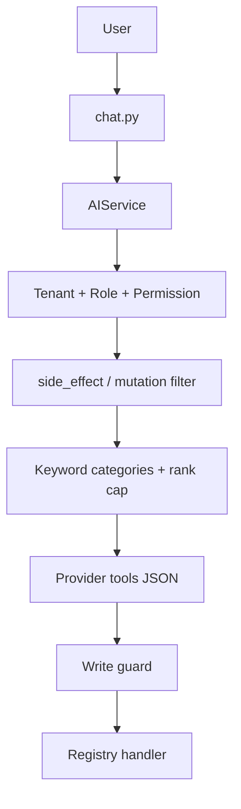
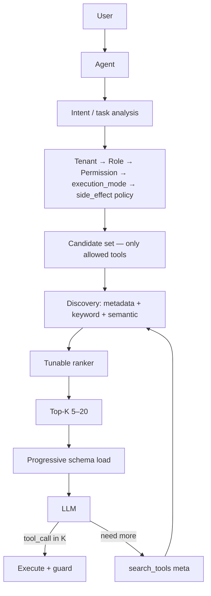
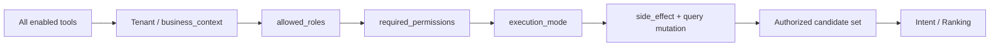

# Target Architecture — Scalable Tool Discovery (1,200+ Tools)

**وضعیت:** Target State مشخص است. Phase 0–14 در کد پیاده شده‌اند. Indexed Retrieval روی Canary ۵٪ است و **Promotion به ۱۰٪ HOLD** است تا ترافیک زنده جمع شود. Adaptive K / Hybrid / Progressive خاموش‌اند.  
**تاریخ:** ۲۱ اوت ۲۰۲۶  
**Source of Truth کد:** `hesabixAPI/app/services/ai/`  
**مرتبط:** [`dynamic-tool-discovery.md`](dynamic-tool-discovery.md)

> LLM فقط حداقل Tool و Schema لازم برای Task جاری را می‌بیند. مقیاس هدف ۱۲۰۰+ است؛ ۱۸۰ Tool فعلی نقطهٔ شروع مهاجرت است نه سقف طراحی.

---

## 1. Current Architecture

وضعیت زنده پس از Phase 0:

- حلقه در `AIService.chat_completion_stream`
- ثبت Static در `AIFunctionRegistry` (Singleton)
- فیلتر: Role + Permission + Execution mode + Intent کلیدواژه‌ای
- سقف: ۴۸ (analyzer) / ۱۲۸ (supervised/autonomous)
- Schema کامل زیرمجموعه از `load_tool_schemas`؛ ساخت JSON فقط برای نام‌های Discovery (نه کل ۱۸۰)
- روی سیم: Provider هنوز `tools` را در **هر iteration** می‌گیرد مگر K کوچک‌تر شود یا cache مخصوص Provider فعال شود
- MCP = سرور خروجی (`POST /api/v1/ai/mcp`)، نه Discovery داخل Agent
- ۱۸۰ `AIFunction` واقعی



پس از Phase 2، Security یک مرز سخت قبل از Ranking است.
پس از Phase 3، همهٔ Consumerهای داخلی از `discover_tools()` برای انتخاب نام استفاده می‌کنند؛ Schema هنوز جدا در `get_available_functions` بارگذاری می‌شود.

مرتبط: [`phase-2-security-first-discovery.md`](phase-2-security-first-discovery.md) · [`phase-3-unified-discovery-api.md`](phase-3-unified-discovery-api.md)

---

## 2. Target Architecture

Discovery **داخل Orchestrator** انجام می‌شود (نه وابسته به مدل). LLM فقط Top-K با Schema کامل می‌بیند؛ در Task مبهم یک meta-tool `search_tools` برای گسترش کنترل‌شده دارد.



لایه‌ها از پایین به بالا:

| لایه | مسئولیت | وابسته به LLM؟ |
|------|---------|----------------|
| Tool Manifest + AIFunction | هویت، دامنه، امنیت، alias | خیر |
| Security gate | Tenant / permission / mode | خیر |
| Discovery engine | جستجو روی candidate مجاز | خیر |
| Schema loader | JSON کامل فقط برای K | خیر |
| Provider adapter | تبدیل OpenAI/Anthropic/Local | بله فقط format |
| Agent loop | فراخوانی و نتیجه | بله |

---

## 3. Design Principles

1. **Minimum tool set:** پیش‌فرض ۵–۲۰ Schema؛ افزایش پویا با سقف مطلق (پیشنهاد ۳۲ Schema کامل در یک call).
2. **Security before search:** Tool بدون اجازه هرگز candidate نمی‌شود.
3. **Single source of truth:** Manifest + فیلدهای `AIFunction` پس از bind. لیست‌های Intent/Write/Risk مشتق می‌شوند.
4. **Provider-agnostic:** کاتالوگ و Discovery فرمت مدل نمی‌دانند.
5. **Fan-in over explosion:** ۱۲۰۰ قابلیت ≠ ۱۲۰۰ function. Entity/report/skill اول.
6. **Measurable:** هر تغییر Discovery با eval طلایی و متریک توکن/latency سنجیده می‌شود.
7. **No fashion-driven MCP:** MCP برای execution بیرونی می‌ماند تا ارزش Discovery داخلی ثابت شود.
8. **Incremental migration:** رفتار ۱۸۰ Tool تا eval سبز نشکند؛ سقف ۴۸/۱۲۸ تا Phase Discovery عوض نشود.

---

## 4. Tool Registry

دو بخش جدا که با bind یکی می‌شوند:

```text
AIFunction (runtime)
├── identity: name, version, description
├── handler + parameters_schema (schema_version)
├── security: roles, permissions, requires_approval, risk_level,
│             is_readonly, is_agent_internal, always_confirm, side_effect
├── discovery: domains, capability, namespace, aliases, keywords,
│              examples, companion_tools, is_core, intent_write
└── lifecycle: enabled, deprecated, replacement
```

**چرا این فیلدها (و نه بیشتر):**

| فیلد | دلیل قابل اندازه‌گیری |
|------|------------------------|
| `domains` | فیلتر Intent / metadata بدون regex روی نام |
| `capability` | آمادهٔ routing دو مرحله‌ای در ۵k+ بدون تغییر مدل |
| `namespace` | جلوگیری از تصادم نام در ۱۲۰۰+ |
| `aliases` / `keywords` / `examples` | keyword + later embedding text |
| `companion_tools` | write بدون حذف lookupهای لازم |
| `is_core` | سیگنال ranking / tie-break / fallback — **نه** ظرفیت رزرو Top-K |
| `intent_write` | کشف نوشتن جدا از `requires_approval` |
| `always_confirm` / `side_effect` | سیاست destructive قبل از LLM |
| `enabled` / `deprecated` / `replacement` | رشد کاتالوگ بدون حذف ناگهانی |
| `version` / `schema_version` | مهاجرت Schema بدون rename اجباری |

عمداً در Phase 1 **نیست** (تا نیاز اندازه‌گیری شود): embedding vector، tenant_allowlist جدا (همان business_context + permission)، provider compatibility matrix (همه Toolها روی هر سه Provider می‌روند مگر `supports_tools` مدل).

Handler در Python می‌ماند. Metadata در `ai_tool_manifest.py` تا Intent بدون instantiate سرویس‌ها کار کند.

---

## 5. Unified Metadata

```text
                    ai_tool_manifest.TOOL_MANIFEST
                                │
                    ai_tool_index.ToolIndex
                       ┌────────┼────────┐
                       ▼        ▼        ▼
                   Intent    Rank     Write/Risk
                       │        │        │
                       └────────┼────────┘
                                ▼
                    registry.register → bind_manifest
                                ▼
                           AIFunction
```

پس از Phase 1:

- `_CATEGORY_TOOLS`, `_WRITE_TOOLS`, `_CORE_TOOL_NAMES`, companions از Index
- `TOOL_ALIASES` از Index
- `WRITE_FUNCTIONS` و `HIGH_RISK_ALWAYS_APPROVE` از Index
- Permission map (`ai_permission_map`) همچنان نگاشت رشتهٔ permission به UI است — آن نگاشت **سیاست محصول** است نه هویت Tool؛ هویت Tool همان `required_permissions` روی `AIFunction` است
- l10n (`ai_tool_keys`) برچسب UI است نه Discovery؛ همگام‌سازی‌اش Phase جدا (اختیاری)

---

## 6. Security Filtering

> **Security is a hard boundary, not a ranking signal.**  
> **A tool must be authorized before it can become a discovery candidate.**  
> **Discovery reduces context; it must never weaken authorization.**

ترتیب اجباری (پس از Phase 2 در کد است):



پیاده‌سازی: `ai_tool_security.filter_security_candidates` قبل از `select_tool_names` / `select_catalog_tool_names`.

- analyzer: فقط `READ_ONLY`
- supervised/autonomous: write فقط با mutation نوشتن؛ delete/export/execute فقط با mutation صریح
- UNKNOWN → NOT CANDIDATE
- Ranking / `prefer_names` / union مهارت نمی‌تواند Tool غیرمجاز را برگرداند
- Execution Guard (`ai_write_guard`) آخرین خط دفاع می‌ماند — Discovery جایگزین آن نیست

جزئیات: [`phase-2-security-first-discovery.md`](phase-2-security-first-discovery.md)

---

## 7. Capability Architecture

سه مفهوم با شغل جدا (Phase 4):

- **Domain:** سطل Intent کلیدواژه‌ای موجود (`financial`, `warehouse`, `people`, …)
- **Capability:** کلید نقطه‌ای جستجوی آینده (`financial.invoice`, `reports.sales`, …)
- **Namespace:** بخش اول capability (`financial`, `reports`) برای ضدتصادم در ۱۲۰۰+

**تصمیم:** در ۱۲۰۰ Tool، router دو مرحله‌ای Capability→Tools **ارزش پیچیدگی runtime را ندارد.** فیلتر domain + hybrid search کافی است. فیلد `capability` از حالا granular است تا Embedding/Hybrid بدون مهاجرت مدل داده کار کند.

Fan-in موجود بماند:

- `query_business_data` (~۳۰ entity) — یک Schema، permission per entity در handler
- `get_report` (~۳۸ type) — یک Schema، کاتالوگ گزارش جدا

Tool جدا فقط وقتی Schema، permission یا ریسک با sibling فرق دارد (مثلاً `delete_invoice` ≠ `search_invoices`).

Generic query خطر دقت و امنیت دارد اگر entity/permission در خود Tool چک نشود. امروز چک می‌شود؛ این قرارداد حفظ شود.

---

## 8. Tool Discovery

موتور جدا از LLM: `ai_tool_discovery.discover_tools`.

ورودی: `permissioned_names` + query + mode + limit + channel + history.
خروجی: `DiscoveryOffer` با `ToolCandidate` سبک (بدون Schema).

Chat / Subagent / CRM / Ticket / Workflow از طریق `get_available_functions` به همین API می‌رسند.
MCP `tools/list` هنوز کاتالوگ permissionخورده است (قرارداد کلاینت خارجی).

استراتژی فعال: `KeywordIntentStrategy`. Semantic/Hybrid رزرو شده و فعال نیست.

---

## 9. Hybrid Search

ترتیب Target پس از security:

```text
candidate (permissioned)
  → metadata filters (domain, side_effect, enabled)
  → keyword / alias / BM25 روی search_text
  → optional vector روی همان search_text
  → merge + score
  → rerank tunable
  → Top-K
  → schema loader
```

تا ~۲۰۰۰ Tool، keyword+index حافظه کافی است. Vector وقتی eval نشان دهد paraphrase فارسی fail می‌شود.

---

## 10. Ranking

امتیاز **وزنی و قابل تنظیم از config/eval** — وزن را حدس نمی‌زنیم:

```text
score = w1*semantic + w2*keyword + w3*alias + w4*core
      + w5*domain_match + w6*historical (capped)
      + w7*specificity - w8*ambiguity
```

وزن‌ها در فایل eval کالیبره می‌شوند. History فقط به عنوان **boost ضعیف با سقف** و با decay؛ هرگز Tool بدون permission را بالا نمی‌آورد.

---

## 11. Progressive Disclosure

سه سطح vis-à-vis LLM:

1. **Always:** core (~۱۲) + در صورت نیاز `search_tools` (schema کوچک)
2. **Task K:** ۵–۲۰ Schema کامل
3. **On demand:** نتیجه `search_tools` → round بعد حداکثر چند Schema اضافه با سقف مطلق

مدل نام خارج از offer را اجرا نمی‌کند (fail-closed).

---

## 12. Schema Loading

Schema کامل فقط برای offer فعلی. منبع: `AIFunction.parameters_schema` از طریق `load_tool_schemas()`.

Discovery (`ToolCandidate`) JSON Schema ندارد.

هدف iteration 2+: اگر hash مجموعه Tool عوض نشده، **از نظر معماری** همان offer است. محدودیت: بسیاری از Providerها `tools` را در هر call می‌خواهند. استراتژی:

- داخلی: `ToolSchemaCache` keyed by `(name, schema_version)`؛ از ساخت مجدد JSON پرهیز
- session: `ToolContextState` فقط schemaهای جدید را می‌سازد
- Anthropic: cache_control روی بلوک پایدار (system)؛ tools جدا است
- OpenAI رسمی: `prompt_cache_key` برای prefix؛ tools ممکن است cache نشود
- Local/vLLM: فرض **resend هر call**؛ بهینه‌سازی = کوچک کردن K نه حذف فیلد API

پس «نفرستادن Schema» فقط جایی تضمین می‌شود که API Provider اجازه دهد. کاهش K اثر قطعی دارد.

**Schema cache is not an authorization cache.** مجوز هر round جداگانه اعمال می‌شود.

جزئیات: [`phase-7-progressive-schema-loading.md`](phase-7-progressive-schema-loading.md)

---

## 13. Caching

| کش | محتوا | محدوده |
|----|--------|---------|
| Manifest/Index | Metadata | فرایند، تا deploy |
| Schema JSON per name | تعریف | فرایند |
| Tool-set hash | offer | session |
| Read-only results | خروجی handler | امروز in-process TTL ۶۰s؛ بعداً Redis چند-worker |
| Prompt cache Provider | system prefix | طبق `ai_prompt_cache.py` |

کش Schema سراسری است؛ فیلتر permission همیشه per-request.

---

## 14. Provider Abstraction

کاتالوگ داخلی خنثی است. `AIProviderBase` همان adapter است:

- OpenAI / Local: `tools: [{type:function, function:{name,description,parameters}}]`
- Anthropic: `_openai_tools_to_anthropic`

Discovery به این لایه وصل نمی‌شود. مدل بدون `supports_tools` اصلاً offer نمی‌گیرد (رفتار فعلی).

---

## 15. MCP Strategy

| نقش | تصمیم |
|-----|--------|
| Tool Execution برای کلاینت خارجی | **بله — همین امروز** |
| Tool Discovery برای Agent داخلی | **خیر در Target نزدیک** |
| tools/list بدون سقف | باید بعداً همان `discover_tools` را صدا بزند |

دلیل: Auth، tenant، execution_mode و eval داخلی از قبل در Hesabix است. MCP Discovery یعنی وابستگی پروتکل و کلاینت. وقتی کاتالوگ چند مستأجر/افزونه خارجی شد، MCP به‌عنوان **منبع Tool شخص ثالث** بررسی می‌شود نه جایگزین Index داخلی.

---

## 16. Database Strategy

| مقیاس metadata | ذخیره |
|----------------|--------|
| ۱۸۰–۱٬۲۰۰ | Manifest در کد + RAM index (الان) |
| ~۱۰٬۰۰۰ | همان + اختیاری جدول PG برای embedding Tool |
| ~۱۰۰٬۰۰۰ | PostgreSQL + pgvector (همان الگوی `ai_knowledge_chunks`) |

Redis برای جستجو لازم نیست؛ برای result cache چند-worker بله.

**در این مرحله migration نیست.** Vector DB جدا تا وقتی pgvector در production ناکافی ثابت شود توصیه نمی‌شود.

---

## 17. Evaluation

گسترش `tests/test_ai_tool_intent_gold.py` + موارد منفی destructive:

برای هر کیس: query، expected tools، forbidden tools، K، tokens تخمینی، latency discovery.

هدف محصولی: Discovery accuracy قابل گزارش (مثلاً ≥۹۵٪ recall روی طلایی واقعی ۱۸۰ نام، صفر نشت `delete_*` روی گزارش‌خوانی).

---

## 18. Observability

رویداد `tool_discovery` (بدون مبلغ/نام مشتری):

`tenant_id, user_id, mode, candidate_count, selected[], scores[], search_ms, schema_tokens, iteration, hash`

اجرا جدا: موفقیت/خطای handler با کد خطا، نه payload مالی.

---

## 19. Failure Handling

| حالت | رفتار |
|------|--------|
| صفر candidate پس از permission | پاسخ: دسترسی/حالت اجرا؛ Tool جعلی نباشد |
| صفر پس از search | یک بار گسترش domain؛ سپس clarification |
| Tool اشتباه / نتیجه خالی | ضدloop موجود (`AGENT_MAX_IDENTICAL_TOOL_*`) |
| نام خارج از offer | `unknown_tool_result` |
| search_tools بی‌نتیجه | توقف گسترش؛ سؤال روشن‌سازی |

Fallback عمومی به «همهٔ financial» فقط با سقف خیلی کوچک و بدون write/delete.

---

## 20. Scalability

| N metadata | Bottleneck |
|------------|------------|
| ۱۸۰ | LLM و تکرار Schema، نه search |
| ۱٬۲۰۰ | همان + Intent شلوغ اگر K کم نشود |
| ۵٬۰۰۰ | نیاز به hybrid + search_tools |
| ۱۰٬۰۰۰ | index RAM هنوز کوچک؛ schema load باید lazy باشد |
| ۱۰۰٬۰۰۰ | pgvector + capability pre-filter؛ LLM همچنان Top-K |

Bottleneck هزینه همیشه LLM است اگر K کنترل شود.

---

## 21. Migration Strategy

1. Phase 1: Manifest = SSOT (انجام‌شده در همین کار)
2. رفتار ۴۸/۱۲۸ تا eval Phase Discovery عوض نشود
3. Dual-read حذف شد؛ لیست‌های کهنه نباید برگردند
4. Tool جدید = Manifest entry اجباری + register (تست پوشش نام‌ها)
5. هرگز REST را 1:1 به Function تبدیل نکنید

---

## 22. Phase Breakdown

| Phase | هدف | خروجی | وابسته |
|-------|------|--------|--------|
| **0** | تحلیل | `dynamic-tool-discovery.md` | — |
| **1** | Unified metadata / SSOT | Manifest + Index + bind | 0 |
| **2** | Security-first discovery | `filter_security_candidates` قبل از rank؛ UNKNOWN fail-closed | 1 |
| **3** | Discovery engine | `discover_tools()` واحد؛ هنوز همان K≈۴۸ برای سازگاری | 1–2 |
| **4** | Tight Top-K + progressive | analyzer ۵–۲۰؛ `search_tools` | 3 |
| **5** | Hybrid / embedding | روی embedder دانشنامه یا PG | 4 + eval |
| **6** | Ranking tunable + history cap | وزن از eval | 5 |
| **7** | Schema/tool-set cache + بودجه tools | hash session؛ تخمین توکن tools | 4 |
| **8** | Eval + observability | طلایی ۱۸۰ واقعی + متریک | 3+ |
| **9** | MCP list از discover_tools | سقف MCP | 3 |
| **10** | Fan-in رشد دامنه / skills | پوشش ۱۲۰۰ قابلیت بدون ۱۲۰۰ function | محصول |
| **11** | Redis result cache / worker | مقیاس کاربر | 7 |
| **12** | Production hardening | cap مطلق، feature flag، rollback | همه |

**Phase 0–10 در کد هستند.** Ranking اصلاح شد (`Recall@15 = 97.5٪`). Schema Loading از Discovery جدا است. Adaptive K و Hybrid و Progressive و Indexed Candidate Retrieval به‌صورت flag خاموش‌اند. سقف production هنوز ۴۸/۱۲۸ است. Canary Adaptive K آماده و HOLD است. Inverted index مشتق برای Candidate Retrieval ساخته شد ولی مسیر آنلاین همان Ranker کامل است.

اصول Phase 6:

- Core is a ranking signal, not a reserved capacity.
- Every authorized candidate must compete on relevance before Top-K truncation.
- Do not introduce semantic retrieval to compensate for a deterministic ranking bug.

### search_tools: گزینهٔ انتخاب‌شده

| گزینه | Token | Latency | Accuracy | وابستگی مدل | پیچیدگی | Debug | امنیت | مقیاس |
|--------|-------|---------|----------|-------------|----------|-------|--------|--------|
| A Orchestrator only | بهترین | بهترین | خوب با rank | کم | متوسط | بالا | بالا | تا ~۲k |
| B فقط Tool LLM | بد در دور اول | +۱ نوبت | وابسته به مدل | زیاد | کم ظاهری | ضعیف | خطرناک اگر قبل از permission | ضعیف |
| **C Hybrid (انتخاب)** | خوب | یک نوبت اضافه فقط در miss | بالا | کم | متوسط | بالا | permission قبل از search_tools | ۱۲۰۰–۱۰k |

Orchestrator همیشه K می‌دهد. `search_tools` Schema کوچک دارد و فقط روی candidate مجاز جستجو می‌کند.

---

## 23. Risks

- Tight K → از دست رفتن Tool دم‌بلند (جبران: search_tools + eval)
- وزن ranking حدسی (ممنوع تا eval)
- Provider که tools را هر بار می‌خواهد (کاهش K نه حذف فیلد)
- انفجار ۱۲۰۰ Function جدا (خلاف fan-in)
- History bias (سقف boost)

---

## 24. Open Questions

- مدل/gateway واقعی production و اثر cache روی `tools`
- فعال بودن pgvector در production
- آیا صوت/تلگرام همان `get_available_functions` را صدا می‌زنند
- سقف مطلق Schema در یک call (پیشنهاد ۳۲ — نیاز به تأیید محصول)

---

## Phase 1 — آنچه در کد فرود آمده

- `ai_tool_spec.py` — انواع، domain، capability، side_effect
- `ai_tool_manifest.py` — یک رکورد per Tool
- `ai_tool_index.py` — ایندکس مشتق + `bind_manifest`
- `AIFunction` فیلدهای Discovery/امنیت
- Intent / aliases / WRITE_FUNCTIONS / HIGH_RISK از Index

رفتار سقف ۴۸/۱۲۸ عمداً عوض نشده است.

## Phase 2 — آنچه در کد فرود آمده

- `ai_tool_security.py` — mutation کوئری، کلاس امنیت Tool، `filter_security_candidates`
- `get_available_functions` فیلتر امنیت را **قبل از** Ranking اعمال می‌کند
- Intent/catalog فقط روی مجموعهٔ مجاز rank می‌کنند
- `filter_function_definitions` fail-closed است
- Execution Guard و MCP `tools/call` دست‌نخورده‌اند

جزئیات: [`phase-2-security-first-discovery.md`](phase-2-security-first-discovery.md)

## Phase 3 — آنچه در کد فرود آمده

- `ai_tool_discovery.py` — `discover_tools`, `DiscoveryOffer`, `KeywordIntentStrategy`
- Chat / Subagent از همین API استفاده می‌کنند؛ Schema جدا بارگذاری می‌شود
- سقف پیش‌فرض ۴۸/۱۲۸ حفظ شد؛ `DISCOVERY_HARD_MAX=256`
- MCP `tools/list` عمداً dynamize نشد
- Vector / hybrid / progressive schema پیاده نشد

جزئیات: [`phase-3-unified-discovery-api.md`](phase-3-unified-discovery-api.md)

## Phase 4 — آنچه در کد فرود آمده

- Permission خالی دیگر fail-open نیست؛ سیاست صریح (`handler` / `self_scoped` / `agent_internal` / `user_context`) یا `required_permissions` واقعی
- `upsert_memory_entry` به‌عنوان WRITE طبقه‌بندی شد
- Capability نقطه‌ای (`reports.sales`, `financial.invoice`, …) + `search_text`
- Quality score فقط برای audit؛ Ranking عوض نشد

جزئیات: [`phase-4-permission-metadata-hardening.md`](phase-4-permission-metadata-hardening.md)
> Phase 4 improves the quality and trustworthiness of the catalog; it does not improve retrieval yet.

## Phase 5 — آنچه در کد فرود آمده

- Gold ۴۷۳ query + Recall/MRR/Precision/NDCG روی `discover_tools` (بدون LLM)
- K sweep نشان داد Tight Top-K در Keyword/Intent فعلی امن نیست
- سقف production همان ۴۸/۱۲۸ ماند
- `DiscoveryOffer` فیلد confidence دارد؛ کاندیداها score-desc مرتب می‌شوند

جزئیات: [`phase-5-tight-topk-evaluation.md`](phase-5-tight-topk-evaluation.md)

## Phase 6 — آنچه در کد فرود آمده

- `rank_and_cap`: score همهٔ authorized candidates، سپس Top-K. Core/prefer دیگر ظرفیت رزرو نمی‌کنند
- `is_core` فقط tie-break است؛ `fallback_names` جدا از ranked results و بدون Schema کامل
- No-match احتیاطی: empty offer فقط وقتی `top_score<=0` و query دامنهٔ ابزار نیست (FN empty روی Gold = ۰)
- Alias/example فقط برای missهای Gold؛ کاتالوگ ۱۸۰ تایی ماند
- سقف production همان ۴۸/۱۲۸؛ `Recall@15 = 97.52٪` روی Gold v1

جزئیات: [`phase-6-ranking-correction.md`](phase-6-ranking-correction.md)

## Phase 7 — آنچه در کد فرود آمده

- `load_tool_schemas` جدا از `discover_tools`؛ `ToolCandidate` بدون JSON Schema
- `ToolSchemaCache` + versioning (`declared.hash`)؛ cache ≠ authorization
- `ToolContextState` در Chat و Subagent؛ CRM / Ticket / Workflow از همان loader
- Progressive loading opt-in (`PROGRESSIVE_SCHEMA_LOADING=False`)؛ production K همان ۴۸/۱۲۸
- Eval: Progressive K=15 حدود ۵۴٪ توکن schema کمتر از Current K=48 اگر مجموعهٔ کوچک‌تر روی سیم برود
- MCP `tools/list` عوض نشد

جزئیات: [`phase-7-progressive-schema-loading.md`](phase-7-progressive-schema-loading.md)

## Phase 8 — آنچه در کد فرود آمده

- `DiscoveryConfidence` + `AdaptiveKPolicy` (برنده eval: tight، Avg K=۱۰.۱۹، Recall=۹۶.۶۱٪) — flag خاموش
- Hybrid اختیاری روی ranker واژه‌ای؛ n-gram metadata؛ وزن lexical_dominant بهترین Hybrid است ولی از Keyword بهتر نیست
- Semantic فقط روی authorized؛ cache/fingerprint ≠ authorization
- `ProviderContextPolicy` + fingerprint؛ Anthropic last-tool cache hint؛ Local = resend
- Rediscovery حداکثر ۱ بار؛ `tool_discovery_miss` telemetry
- Benchmark مصنوعی تا ۱۰٬۰۰۰ metadata؛ Schema Top-15 ≈۳.۵ms
- Production همچنان Analyzer=۴۸ / Autonomous=۱۲۸

جزئیات: [`phase-8-adaptive-hybrid-context.md`](phase-8-adaptive-hybrid-context.md)

## Phase 9 — Production Canary architecture

هدف: رفتار Adaptive K را روی ترافیک واقعی بسنجید؛ Offline Gold را با Tool Discovery Success زنده اشتباه نگیرید.

```text
Tenant + Role + Permission + mode
        ↓
Keyword/intent ranker   (یکسان برای هر دو بازو؛ Hybrid OFF)
        ↓
Wide candidates (Analyzer 48 / Autonomous 128)
        ↓
         ┌─ control ──────────── effective K = 48/128
hash(biz, user) % 100
         └─ experiment ──────── Adaptive tight truncate (≈10/15/20)
        ↓
load_tool_schemas  (Progressive flag جدا و خاموش)
        ↓
LLM  →  typed miss / rediscovery≤1 / execution
```

قواعد:

1. `ADAPTIVE_DISCOVERY_K` و `ADAPTIVE_K_ROLLOUT_PERCENT` مستقل از `PROGRESSIVE_SCHEMA_LOADING` هستند.
2. Assignment با SHA256 پایدار است؛ شناسه در Log نیست.
3. `retrieval_miss` / `schema_miss` / `authorization_failure` / `execution_failure` رویدادهای جدا هستند.
4. Tool مجازِ unoffered = Discovery failure. Tool غیرمجاز هرگز rediscover نمی‌شود.
5. Metric روی سیم: `schema_count` + `wire_schema_tokens` — نه cache hit ارائه‌دهنده.
6. Hybrid Canary ندارد. Semantic خطی ۱۰k Production نیست.
7. Phase 10: inverted index + vector ANN روی metadata، سپس ranker فعلی، Adaptive K، Progressive Schema.

تصمیم فعلی: **HOLD** (نمونه زنده < ۵۰۰ در هر بازو).

جزئیات: [`phase-9-adaptive-k-canary.md`](phase-9-adaptive-k-canary.md)

## Phase 10 — Scalable candidate index

```text
Tool Registry → Security → Candidate Retrieval (inverted ⊕ optional ANN)
        → Existing Ranker → Adaptive K → Progressive Schema → LLM
```

- Registry = source of truth. Index = derived posting lists + capability/domain/namespace maps.
- `INDEXED_CANDIDATE_RETRIEVAL = False` — Production هنوز همهٔ Authorized را rank می‌کند.
- Candidate Recall@100 = ۹۸.۸۷٪ (اشباع؛ ۵ miss متادیتا). هدف ۹۹٪+ نرسید → flag خاموش ماند.
- Vector ANN / pgvector برای Tool ساخته نشد. pgvector موجود برای دانشنامه است.
- Neural embedding و Hybrid Production خاموش‌اند.
- Adaptive K Promoted نشد.

جزئیات: [`phase-10-scalable-tool-index.md`](phase-10-scalable-tool-index.md)

## Phase 11 — Index quality and independent canary

پنج miss متادیتا پوشش داده شد. Candidate Recall@100 = ۱۰۰٪. N بزرگ نشد.

```text
Control:     Authorized → Phase 6 Ranker → K=48/128
Experiment:  Authorized → Indexed candidates (N=100) → Phase 6 Ranker → K=48/128
```

- `INDEXED_CANDIDATE_RETRIEVAL = False` و `INDEXED_CANDIDATE_ROLLOUT_PERCENT = 0`.
- Assignment با salt جدا (`indexed-retrieval-v1`) از Adaptive K.
- Fallback خالی → Ranker روی همان Authorized Set؛ هرگز Global Registry.
- `indexed_retrieval_miss` ≠ `retrieval_miss`.
- Adaptive K HOLD. Hybrid OFF.

جزئیات: [`phase-11-index-quality-canary.md`](phase-11-index-quality-canary.md)

## Phase 12 — Indexed retrieval production canary

تنها متغیر: Candidate Retrieval (full authorized vs indexed N=100). Ranker / K / Schema / Adaptive / Hybrid ثابت.

```text
INDEXED_CANDIDATE_RETRIEVAL = False
INDEXED_CANDIDATE_ROLLOUT_PERCENT = 5
INDEXED_CANDIDATE_FALLBACK = True
```

- Assignment: SHA256(`indexed-retrieval-v1` + business_id + user_id). شناسه لاگ نمی‌شود.
- Kill switch بدون دست‌زدن به Adaptive: `HESABIX_INDEXED_CANDIDATE_KILL=1` یا `HESABIX_INDEXED_CANDIDATE_RETRIEVAL=0`.
- Fallback reasons (Phase 13 canonical): `empty` / `low_candidate_quality` / `stale_index` / `index_error` / `index_inconsistency` / `unknown`.
- Live promotion: **HOLD** تا ۵۰۰ نمونه در هر بازو.

جزئیات: [`phase-12-indexed-retrieval-canary.md`](phase-12-indexed-retrieval-canary.md)

## Phase 13 — Production evidence gate

شواهد Gold و Production جدا می‌مانند. رویداد `indexed_candidate_exposure`، شمارنده‌های بازو، hit/miss/empty/stale، و `index_success ≠ task_success`. Auto-promotion ممنوع. Kill switch بدون restart. نردبان ۵/۱۰/۲۵/۵۰/۱۰۰ فقط با تصمیم صریح.

این محیط: Live control = 0، Live experiment = 0 → **HOLD**. Adaptive K / Hybrid / Progressive همچنان OFF.

جزئیات: [`phase-13-production-evidence-gate.md`](phase-13-production-evidence-gate.md)

## Phase 14 — Live canary validation

فقط جمع‌آوری و ارزیابی شواهد Production. Gold / Control / Experiment جدا. `live_control_requests` / `live_experiment_requests`. `indexed_retrieval_error` و Fallback counters جدا از Miss. Task completion ساختگی نیست. Channel-specific HOLD: `HESABIX_INDEXED_CANDIDATE_CHANNEL_HOLD`. این محیط همچنان ۰/۰ → **HOLD**.

جزئیات: [`phase-14-live-canary-validation.md`](phase-14-live-canary-validation.md)
